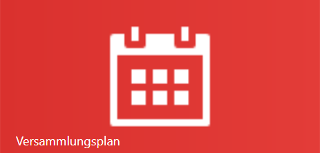

Die Verwaltung deiner eigenen Redner- und Vortragsplanung geschieht hier. 
Dieser Programmbereich besteht aus drei Unterbereichen:

* [Kalender](MeinPlan.md): Dies ist der Hauptbereich für deine Planung. Hier siehst du deine aktuelle Planung und kannst sie auch pflegen.
* [Redner suchen](MeinPlan.md#redner-suchen): Hier findest du die Vorträge und Redner die du schon länger nicht mehr gehört hast und kannst Einladungsmails generieren.
* [Antwort eintragen](MeinPlan.md#antwort-eintragen): Hat jemand auf deine Einladung geantwortet, trägst du hier die Antwort ein. Dein Versammlungsplan wird dann aktualisiert.

# Redner suchen

Eine der häufigsten Tätigkeiten ist es, nach Vorträgen und Rednern für die eigene Versammlung zu suchen. Die Suchfunktion wird über das Menü auf der Startseite, oder per [Kontextmenü](Konzept.md#Kontextmenü) in dem Fenster "Mein Plan" einer offenen Woche aufgerufen.

Das Fenster besteht aus 3 Bereichen.

1. Filter
2. Datum
3. Rednerauswahl

## Filter
Du kannst die zu suchenden Redner nach folgenden Kriterien Filtern:

1. Versammlungen

    1. Kreis:  
    Suche nur Versammlungen und Redner im Kreis XXX, eine Mehrfachauswahl ist hier möglich.
    2. max. Entfernung  
    Alle Versammlungen auf die Entfernung filtern. Versammlungen die weiter weg sind als hier angegeben, werden bei der Suche nicht berücksichtigt.
    3. offene Anfrage:
    Versammlungen bei denen noch Anfragen ausstehen werden bei der Suche nicht berücksichtigt.
    4. Versammlungen:  
    Das Auswahlfeld berücksichtigt bereits die Filter 1-3. Hier werden also nur die Versammlungen angezeigt, die den bisherigen Suchkriterien entsprechen. Zusätzlich können hier weitere Versammlungen aus der Suche entfernt werden.

2. Redner + Vortrags-Filter 

    1. Redner ausblenden, für die bereits eine Absage erteilt wurde. Der Filter ist für die entsprechenden Redner aktiv, bis das Datum der Absage erreicht ist.
    2. Redner ausblenden, die bereits in der Zukunft eingeladen sind (in der Zukunft).
    3. Redner ausblenden, die in den letzten 12 Monaten bereits eingeladen wurden
    4. Vorträge ausblenden, die bereits eingeplant sind (in der Zukunft).
    5. Vorträge ausblenden, die in den letzten 12 Monaten bereits gehalten wurden.
    6. Vorträge:  
    Das Auswahlfeld berücksichtigt bereits die Filter 4+5. Hier werden also nur noch die Vorträge angezeigt, die den bisherigen Suchkriterien entsprechen.

### Datumsauswahl
Als nächstes solltest du prüfen für welche deiner freien Planungen du eine Anfrage an einen Koordinator schicken willst.
Es gibt mehrere vorgespeicherte Sets, wie
* alle offenen Planungen der nächsten 1/3/6/12 Monate.
* nur für den nächsten freien Termin.

Die Änderungen siehst du direkt an dem Hacken neben den einzelnen Wochen, die sich abhängig von deiner Auswahl verändern.

Zusätzlich kannst du hier nun einzelne Wochen hinzunehmen oder abwählen.

### Suchen
hast du deine Filter eingestellt, kannst du unten links auf "Redner suchen" klicken.

Die Ergebnisse werden sofort rechts unterhalb des Datumfeldes angezeigt.

### Suchergebnisse

In diesem Beispiel wurden zwei Versammlungen gefunden, die den Suchkriterien entsprechen bzw. deren Redner den Kriterien entsprechen.
Du musst dich nun entscheiden welche der Versammlungen du für die oben markierten Wochen nach einem oder mehreren Redner(n) angefragt werden soll.

Sollten mehrere Redner einer Versammlung den Kriterien entsprechen, können sie alle in einer Anfrage angefragt werden. Oder du entfernst den Hacken links neben dem Namen und der Redner wird bei seinem Koordinator nicht angefragt. 

Auch den zu haltenden Vortrag kannst du je Redner abändern.
Im Suchfeld werden dir mehrere Informationen zu jedem Vortrag des Redners angezeigt:
1. die Vortragsnummer
1. das Thema
1. Wie oft der Vortrag in deiner Versammlung bereits gehört wurde
1. Wann dieser Vortrag das letzte mal gehalten wurde (egal von welchem Redner)

Hast du alles nach deinen Wünschen eingestellt, kannst du auf "Redner anfragen" klicken.
Es wird dir nun der generierte Mailtext für deine Anfrage angezeigt, denn du wieder nach jwpub.org kopierst.

Im Hintergrund wird die Anfrage abgespeichert, eine weitere Suche nach Rednern würde jetzt also die Versammlung und angefragten Redner genauso herausfiltern wie der gewählte Redner und Vortragsthema.

Ist die Anfrage erstellt und mit jwpub.org versendet, heißt es warten bis der Koordinator sich wieder meldet. 

[zurück](MeinPlanKalender.md){: .btn .btn--inverse}  [weiter](MeinPlanAntwortEintragen.md){: .btn .btn--inverse}