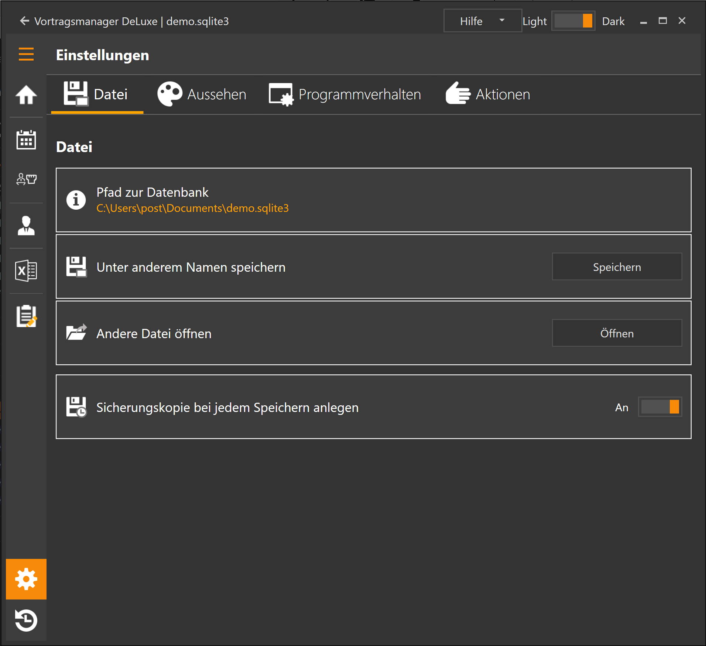
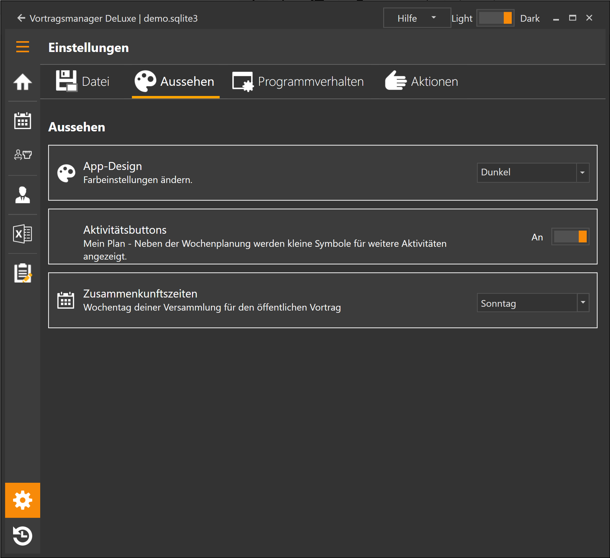
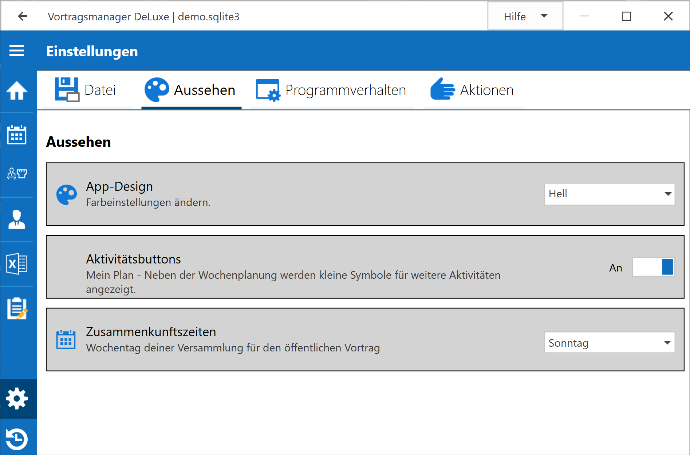
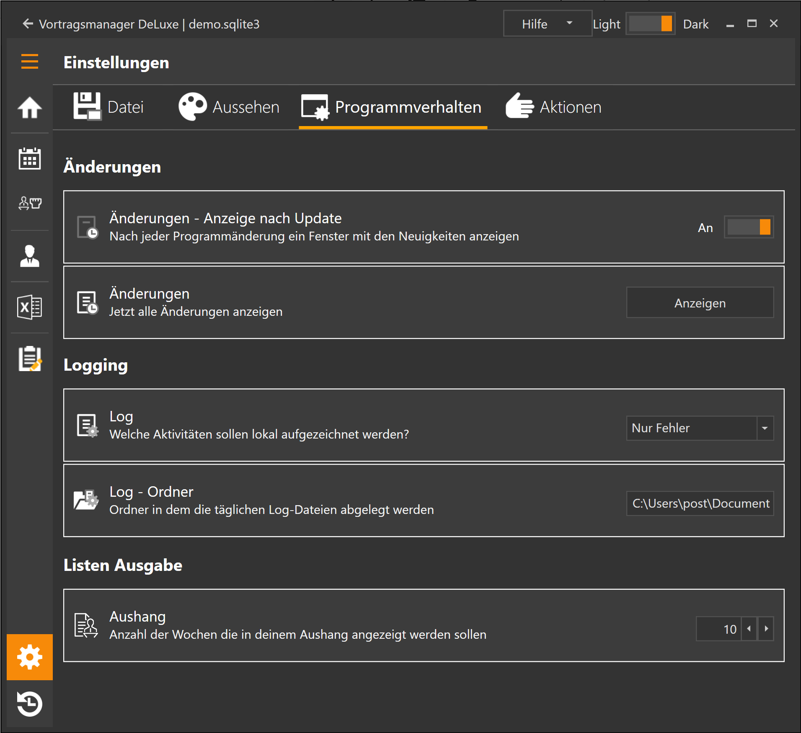
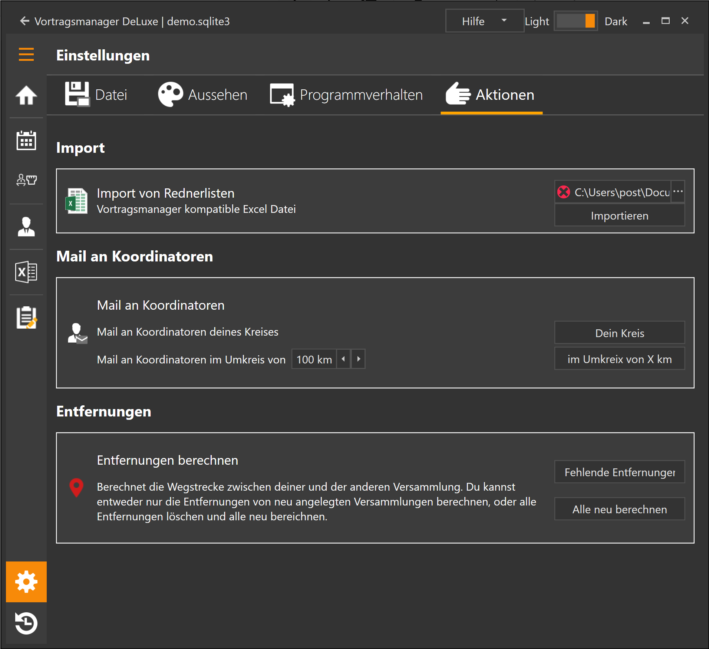

Dieser Bereich besteht aus 4 Unterbereichen:

* [Datei](#datei): Ändern der Datei in der deine Planung gespeichert wird
* [Aussehen](#aussehen): Einstellungen zum Aussehen des Programm
* [Programm](#programmverhalten): Einstellungen zum Verhalten des Programm
* [Aktionen](#aktionen): Aktionen die in keinen anderen Bereich passen

# Datei

Hier kann der Pfad zur Programmmanager-Datei geändert oder auch eine vorher gesicherte Datei geöffnet werden.

Ist die Option "Sicherungskopie bei jedem Speichern anlegen" aktiviert, werden während des arbeiten mit dem Vortragsmanager regelmäßig kopien der Datendatei angelegt, so dass man bei einem Fehler einfach eine ältere Version der Datei öffnen kann. 
Für das Wiederherstellen dieser Sicherungen, sieh unter [Historie -> Sicherung](HistorieSicherung.md) nach

# Aussehen

### App-Design
Hier kannst du die Farbeinstellung des Programm ändern:
* Dunkel: Das klassische Programmaussehen mit Schwarzem Hintergrund und Orangen Elementen.
* Hell: Ein weißer Programmhintergrund mit Blauen Elementen

### Aktivitätsbuttons
im Bereich [Mein Plan](MeinPlanKalender.md) werden im Kalender kleine Buttons angezeigt, über die Aktionen durchgeführt werden können (Alternativ mit der rechten Maustaste auf ein Element klicken).

### Zusammenkunftszeiten
Hier legst du den Wochentag deiner eigenen Versammlung fest. Dies Verändert die Datumsanzeige deiner Planungen auf den jeweiligen Tag.

## Excel Vorlagen

### Aushang
Hier kannst du den Pfad zu deiner eigenen Vorlage für den Aushang hinterlegen. Möchtest du die Standard-Vorlage benutzen, dann lass das Feld einfach leer.
In deiner Excel-Vorlage kannst du folgende Platzhalter einsetzen.
* \{Datum_01} = Das Datum der Woche
* \{Thema_01} = Vortragsthema
* \{Name_01} = Name des Redner
* \{Versammlung_01} = Versammlung des Redner
* \{Vorsitz_01} = Name des Vorsitzenden
* \{Leser_01} = Name des eingeteilten Leser
* \{Auswärts_01} = Kombination von Name+Ort erzeugt: "Redner Auswärts: NAME in VERSAMMLUNG, NAME2 in VERSAMMLUNG2"
* \{Auswärts_Nr_01} = Kombination von Name+Ort+Vortragsnummer. erzeugt: "NAME in VERSAMMLUNG (NR), NAME2 in VERSAMMLUNG2 (NR2)"
* \{Auswärts_Name_01} = NAME, NAME2
* \{Auswärts_Ort_01} = ORT, ORT2

Werden weitere Platzhalter benötigt, gebt mir Bescheid.
Die Zahl 01 wird für jede Woche um 1 hochgezählt, Die Zuerst Ausgegebene Woche hat die 01, die nächste 02 usw.
Maximal sind 53 Ausgabewochen möglich (= 1 Jahr)

# Programmverhalten

## Änderungen

Wird eine neue Programmversion installiert, werden die letzten Änderungen angezeigt. Dies kann hier deaktiviert werden
Außerdem kannst du dir alle bisherigen Programmänderungen (Changelog) anzeigen lassen.

## Logging

Hier kann angegeben werden wie detailiert das Aufrufen von Funktionen im Vortragsmanager protokolliert werden soll.

Der Standard ist auf "Fehler" gesetzt. Das sollte bei den meisten Problemen helfen diese zu finden und zu beheben. Sollte man hier nicht weiter kommen, kann das Log noch auf **Alles Logen** umgestellt werden. Dies wird aber nur in seltenen Fällen bei Anfrage durch mich benötigt.

Im Ordner wird noch angegeben in welchem Ordner die Dateien abgelegt werden sollen. Der Dateiname ist immer vortragsmanager_DATUM.log und wird jeden Tag geändert.

## Listenausgabe

Optionen für die Ausgabe der Listen können hier eingestellt werden. 
Diese Optionen sind auch im Menüpunkt [Liste ausgeben](ListeAusgeben.md) verfügbar.

# Aktionen

## Import von Rednerlisten

Als ersten Test zum vereinfachten Datenaustausch ist hier die Möglichkeit eingebaut, Rednerlisten im Excelformat zu importieren.

UNDER CONSTRUCTION

## Mail an Koordinatoren

Musst du mal eine Rundmail an mehrere Koordinatoren schreiben, kannst du die Liste aller Mail-Adressen hier abrufen. 
Du kannst entweder alle Koordinatoren deines Kreises, oder alle Koordinatoren im Umkreis von XX km anschreiben.

## Entfernungen der Versammlungen zu meiner berechnen

Vortragsmanager kann für den Entfernungsfilter die Strecke von deinem Saal zu den anderen Sälen berechnen. Die Berechnung geschieht mit der Google Drive API. Als Start/Zieladresse wird die für die Versammlung hinterlegte Saaladresse genommen. Ist keine hinterlegt, wird der Mittelpunkt der Stadt als Routingpoint genommen.

Du kannst hier entweder alle Berechnungen neu vornehmen lassen, oder nur die fehlenden (z.B. neu angelegte Versammlungen) berechnen lassen.

Da ich kein Unbegrenztes Limit an Berechnungen bei Google habe, bitte ich diese Funktion nicht unnötig zu benutzen und nach Möglichkeit keine bereits gerechneten Entfernungen nochmals zu berechnen.

[zurück](VerwaltungVorlagen.md){: .btn .btn--inverse}  [weiter](Historie.md){: .btn .btn--inverse}