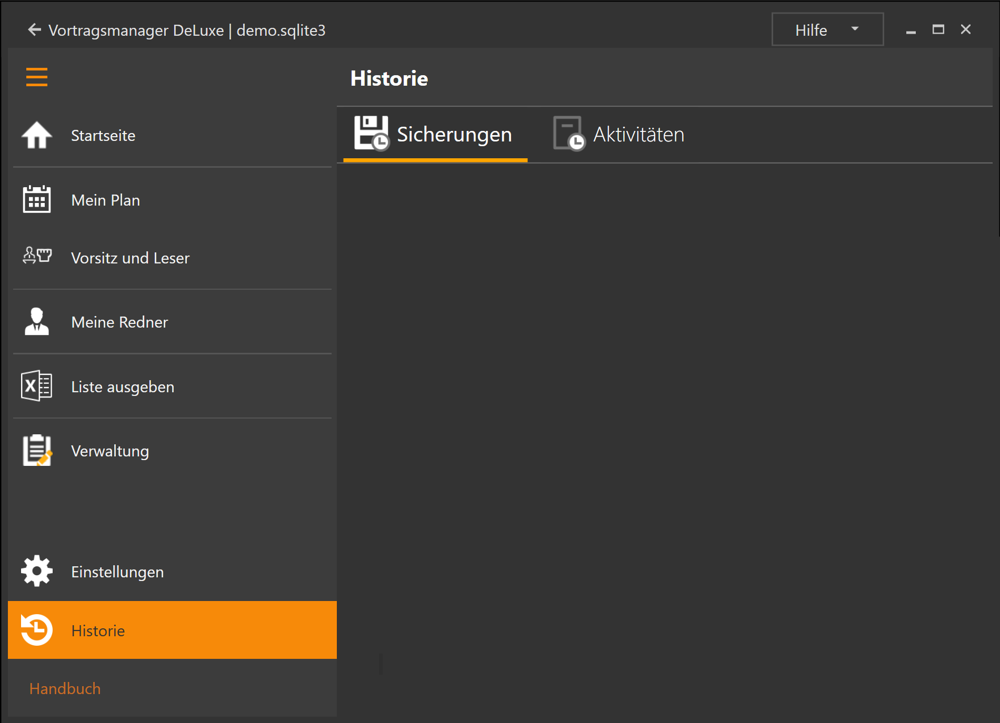

Dieser Programmbereich besteht aus zwei Unterbereichen:

* [Sicherungen](HistorieSicherungen.md): Historische Planungsstänge
* [Aktivitäten](HistorieAktivitäten.md): Übersicht der Programmaktivitäten.

[zurück](Einstellungen.md){: .btn .btn--inverse}  [weiter](HistorieSicherung.md){: .btn .btn--inverse}