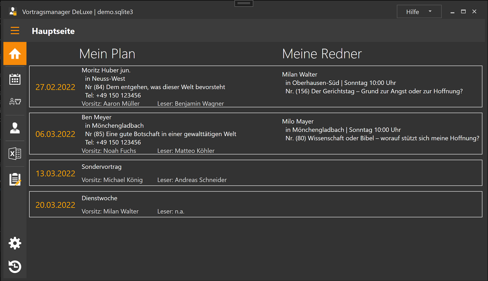

# Handbuch zum Vortragsmanager DeLuxe 1.0

Eine Kurzübersicht über das Programm findest du in der [Readme](./../README.md) im Hauptverzeichnis.

## [Installation](Installation.md) ##
Die Beschreibung der Installation und der ersten Schritte (Datenimport) findest du im Kapitel  [Installations-Anleitung](Installation.md)

## Die Oberfläche ##

Der Vortragsmanager ist in 3 Bereiche aufgeteilt:

1. [Mein Plan](MeinPlan.md): Hier verwaltest du die Vorträge, die in deiner Versammlung gehalten werden.
    * [Redner suchen](MeinPlan.md#redner-suchen): passende Vorträge und Redner suchen und eine Mail an den Koordinator erzeugen.
    * [Antwort eintragen](MeinPlan#antwort-eintragen): Wenn der Koordinator sich dann meldet, kann seine Antwort hier eingetragen werden.

1. [Meine Redner](MeineRedner.md): Hier verwaltest du die Einladungen deiner Redner in anderen Versammlungen.
    * [Neue Externe Anfrage](MeineRedner.md#neue-externe-anfrage): Fragt ein Koordinator einen deiner Redner an, kannst du seine Verfügbarkeit hier prüfen und eine Antwort an den Koordinator generieren.

1. [Verwaltung](Verwaltung.md): Hier werden die Versammlungsdaten, Rednerdaten, Textvorlagen sowie Programmeinstellungen verwaltet. Außerdem können hier diverse Listen ausgegeben werden.
    * [Listen ausgeben](Verwaltung.md#listen-ausgeben)
    * [Versammlungen](Verwaltung.md#versammlungen): Versammlungs-, Koordinator- und Rednerdaten bearbeiten.
    * [Vorlagen](Verwaltung.md#vorlagen): Vorlagentexte für die Kommunikation mit anderen Verwalten.
    * [Programm](Verwaltung.md#programm): Programmeinstellungen vornehmen und Zusatzfunktionen aufrufen.

PS: In der Titelleiste sieht man hinter dem Programmnamen den Namen der Datei in der deine Daten gespeichert werden.

# Inhaltsverzeichnis dieses Handbuches

1. [Installation](Installation.md)
    1. [Programm installieren](Installation.md#installation)
    1. [Wizard (Datenimport)](Installation.md#wizard)
        1. [Datenbank öffnen](Installation.md#datenbank-öffnen)
        1. [Mit leerem Programm starten](Installation.md#mit-leerem-programm-starten)
        1. [Import der vplanung.net Daten](Installation.md#import-der-vplanung-net-daten)

1. [Mein Plan](MeinPlan.md)
    1. Mein Plan
        1. [Ereignistypen](MeinPlan.md#die-ereignistypen)
        1. [Aktionen](MeinPlan.md#aktionen)
    1. [Redner suchen](MeinPlan.md#redner-suchen)
    1. [Antwort eintragen](MeinPlan.md#antwort-eintragen)

1. [Meine Redner](MeineRedner.md)
    1. Meine Redner
    1. [Neue externe Anfrage](MeineRedner.md#neue-externe-anfrage)

1. [Verwaltung](Verwaltung.md)
    * [Listen ausgeben](Verwaltung.md#listen-ausgeben)
    * [Versammlungen](Verwaltung.md#versammlungen)
       1. [Versammlungen](Verwaltung.md#versammlung)
       1. [Koordinatoren](Verwaltung.md#koordinator)
       1. [Redner](Verwaltung.md#redner)
    * [Vorlagen](Verwaltung.md#vorlagen)
    * [Programm](Verwaltung.md#programm)
