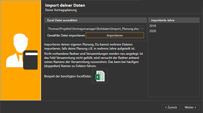

Startest du den Vortragsmanager zum ersten mal erscheint ein Wizard der dir bei den ersten Schritten behilflich sein soll.
Du hast 4 verschiedene Möglichkeiten wie du starten kannst.

 

 1. Ich habe eine Vortragsmanager Datenbank die ich öffnen möchte ⇒ [hier weiter lesen](#datenbank-öffnen)
 1. Ich habe Daten von einem anderen Programm und möchte sie importieren. ⇒ [hier weiter lesen](#import-der-daten-aus-excel)
 1. Ich möchte das Programm mit Demodaten öffnen um das Programm zu testen.  ⇒ [hier weiter lesen](#demo)
 1. Ich habe keine Daten und möchte mit einem leeren Programm starten. ⇒ [hier weiter lesen](#mit-leerem-programm-starten)

## Datenbank öffnen ##
Solltest du bereits eine Datei für den Vortragsmanager haben, kannst du hier im nächsten Schritt den Pfad zu deiner Datei auswählen und diese öffnen. Der Pfad wird im Programm gespeichert, so dass beim nächsten Programmstart die Datei automatisch geöffnet wird.

## Mit leerem Programm starten ##

Der Assistent wird beendet und du startest mit einem leeren Programm, in dem du alle deine Daten erfassen kannst.

## Demo ##
Hier wird eine Beispielplanung für das aktuelle und vorherige Jahre erstellt und angezeigt. Du kannst nach belieben die Planung ändern, Redner hinzufügen und löschen, Listen ausgeben etc. und damit das Programm auf Herz und Nieren testen um zu Entscheiden ob die gebotene Funktionalität deinen Anforderungen entspricht.

## Import der Daten aus Excel ##

Da die meisten sicherlich bereits irgendein Programm haben und die meisten Programme ihre Daten als Excel-Datei speichern können, ist der Import aus Excel der komfortabelste Weg.
Hier benötigst du 4 verschiedene Excel-Dateien, Das Dateiformat muß mindestens Excel 2007 (Dateiendung .xlsx) sein:

* Eine Liste aller Versammlungen mit Adresse und Kontaktdaten des dortigen Vortragskoordinator
* Eine Liste aller Redner aus deinem Kreis mit ihren jeweiligen Vortragsnummern sowie ihren Kontaktdaten, sofern vorhanden
* Plan deiner eigenen Planung für deine Versammlung
* Liste der Termine für deine Redner in anderen Versammlungen

Bei jedem Import wird die jeweils eine Beispiel-Excel Datei angeboten. Du kannst diese öffnen und mit deinen Daten füllen, oder deine vorhandene Datei so anpassen, das sie dem Beispiel entspricht.
Wichtig ist dabei, das alle Spalten in der vorgegebenen Reihenfolge existieren. Wenn du die Information nicht hast, kannst du die Spalte einfach leer lassen, es sind nur wenige Spalten wirklich notwendig.

### Import der Versammlungen und Koordinatoren ###

{: .align-right}
Zuerst werden die Versammlungen und die Koordinatoren importiert. In der rechten Fensterhälfte siehst du, wie viele Versammlungen von dem Programm importiert worden sind.
Solltest du einen Fehler gemacht haben, geh im Assistent einfach noch einmal einen Schritt zurück und wiederhole den letzten und den aktuellen Schritt noch einmal.

Notwendig ist hier die Spalte 2 mit dem Namen der Versammlung. Ist dieses Feld leer, hört der Assistent auf die Datei einzulesen.
Fehlen Informationen, werden die Felder später im Programm leer gelassen, oder bei notwendigen Informationen mit Standard-Werten ersetzt.
So wird bei der Kreis-Nummer -1 eingegeben wenn das Feld leer ist und die Versammlungszeit auf Sonntag 10:00 Uhr eingestellt.

Dieser Import kann auch übersprungen werden. Die Versammlungen können auch über die Rednerliste importiert werden.

 

{: .align-right}
Nun siehst du alle im vorherigen Schritt importierten Versammlungen. Wähle aus den Versammlungen aus, welche dieser Versammlungen deine eigene ist.
Bei mir ist das der Eintrag "Berlin 1".
Sollte deine eigene Versammlung in der vorherigen Liste nicht enthalten sein, dann Deaktiviere die Box "Meine eigene Versammlung wurde ebenfalls importiert". 
In diesem Fall wird eine neue Versammlung angelegt, die du später umbenennen kannst.

 

{: .align-right}
Nun werden die Redner importiert. Im Rechten Bereich siehst du wieviele Redner zu den einzelnen Versammlungen importiert worden sind.

In dieser Liste müssen der Name der Versammlung und der Name des Redners eingetragen sein. Alle weiteren Felder sind optional.
Ist der Name der Versammlung unbekannt, wird sie neu angelegt.

 

{: .align-right}
Als nächstes werden die bisherigen Vortragseinladungen importiert. Also alle Vorträge die in deiner Versammlung gehalten wurden.
Pflichtfeld ist das Datum des Ereigniss und entweder ein Redner plus Vortragsnummer oder im Feld Vortragsthema eines der folgenden Einträge:
* Weltzentrale (Streaming)
* Kreiskongress
* Regionaler Kongress
* Sondervortrag
* Streaming
* Dienstwoche

 

{: .align-right}
Als letzter Schritt werden nun die Vortragseinladungen deiner Redner in anderen Versammlungen importiert. 

Die importierten Jahre werden dir zur Kontrolle wieder rechts angezeigt.
Pflichtfelder sind Datum, Rednername und Vortragsnummer.
Alternativ kann im Feld mit dem Versammlungsname das Wort "Urlaub" eingetragen, dann wird die Woche für den Redner als "Abwesend" markiert.

[zurück](Installation.md){: .btn .btn--inverse}  [weiter](MeinPlan.md){: .btn .btn--inverse}