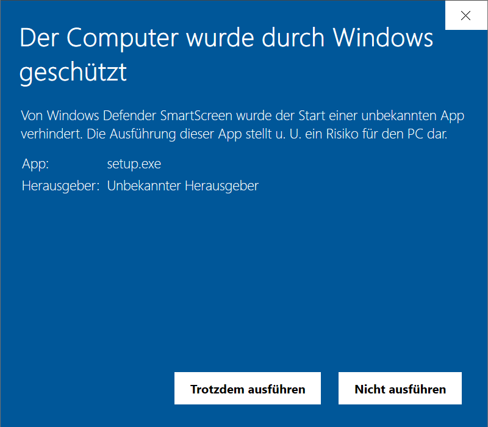
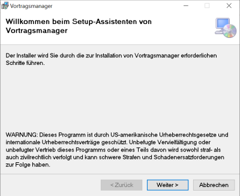
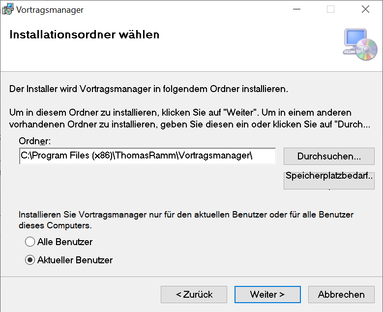
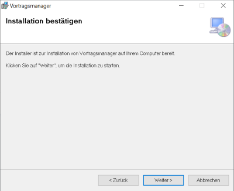
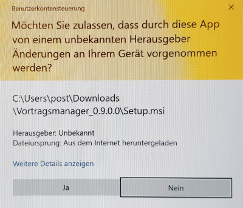
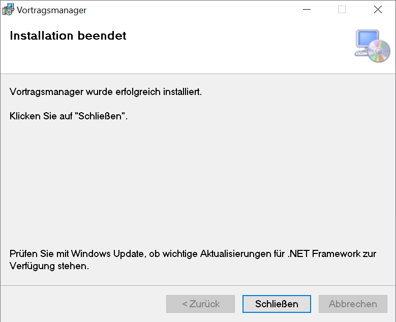

⇦ zurück zum [Inhaltsverzeichnis](README.md)

Die Installation teilt sich in zwei wichtige Schritte ein.
1. Die [Programminstallation](#installation) unter Windows
2. Der [Setup-Wizard](#wizard) beim ersten Programmstart

# Installation #

1. Lade dir das Archiv [Vortragsmanager.zip](http://thomas-ramm.de/Vortragsmanager/Vortragsmanager.zip) herunter.

1. Entpacke das Archiv (rechte Maustaste -> Archiv entpacken).
 In dem erstellten Ordner **Vortragsmanager** startest du die eigentliche Installation mit **Setup.exe**.

1. Nun werden einige Sicherheitswarnungen angezeigt weil Microsoft mein Programm nicht kennt (was ich durchaus nachvollziehen kann 😉):
 Im ersten Dialog klickst du auf *Weitere Informationen*
 
 Nun wird dir ein neuer Button angezeigt *Trotzdem ausführen*. Diesen bitte bestätigen.
 
1. Nun startet die eigentliche Programminstallation. Klicke auf *Weiter*
 
1. Jetzt kann er Installationsordner abgeändert werden.
 
1. Zum Schluss noch die Installation durch klick auf *Weiter* bestätigen.
 
1. Eventuell wirst du nochmals gefragt ob das Setup wirklich Änerungen an deinem Gerät vornehmen darf, was nochmals mit *Ja* bestätigt weren muß.
 
1. Nun wird das Programm installiert, was bei mir wenige Sekunden dauert. Am Ende wird das Setup durch klick auf *Schließen* beendet.
 

In deinem Startmenü hast du jetzt einen Eintrag zum starten des Vortragsmanagers.

# Wizard #

UNDER CONSTRUCTION

⇦ zurück zum [Inhaltsverzeichnis](README.md)