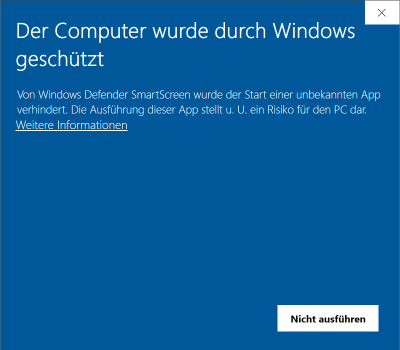
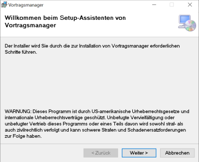
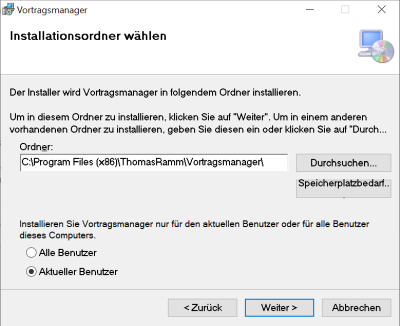
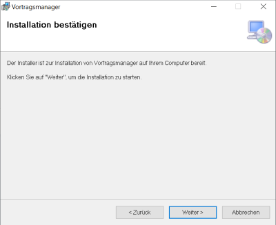
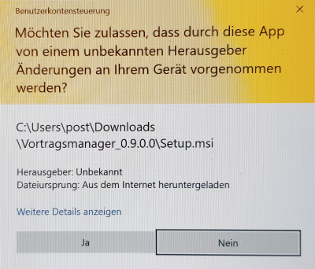
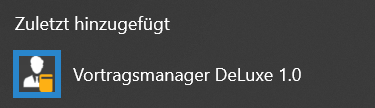
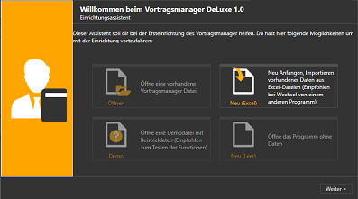
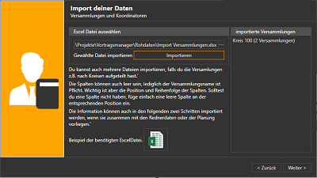
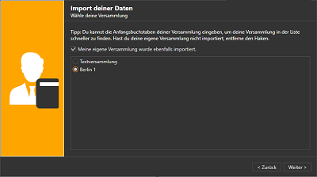
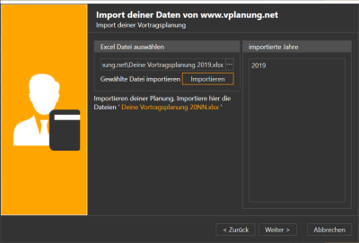

⇦ zurück zum [Inhaltsverzeichnis](README.md)

Die Installation teilt sich in zwei wichtige Schritte ein.
1. Die [Programminstallation](#installation) unter Windows
2. Der [Setup-Wizard](#wizard) beim ersten Programmstart

## Inhaltsverzeichnis
1. [Installation](#installation)
1. [Wizard](#wizard)
    1. [Datenbank öffnen](#datenbank-öffnen)
    1. [Mit leerem Programm starten](#mit-leerem-programm-starten)
    1. [Import der vplanung.net Daten](#import-der-vplanung-net-daten)

# Installation #

1. Lade dir das Archiv [Vortragsmanager.zip](http://thomas-ramm.de/Vortragsmanager/Vortragsmanager.zip) herunter.

1. Entpacke das Archiv (rechte Maustaste -> Archiv entpacken).
 In dem erstellten Ordner **Vortragsmanager** startest du die eigentliche Installation mit **Setup.exe**.

1. Nun werden einige Sicherheitswarnungen angezeigt weil Microsoft mein Programm nicht kennt (was ich durchaus nachvollziehen kann 😉):

Im ersten Dialog klickst du auf *Weitere Informationen*

 
Nun wird dir ein neuer Button angezeigt *Trotzdem ausführen*. Diesen bitte bestätigen.
 

Jetzt startet die eigentliche Programminstallation. Klicke auf *Weiter*

Als nächstes kann der Installationsordner abgeändert werden.

Zum Schluss noch die Installation durch klick auf *Weiter* bestätigen.

Eventuell wirst du nochmals gefragt ob das Setup wirklich Änerungen an deinem Gerät vornehmen darf, was nochmals mit *Ja* bestätigt weren muß.

Endlich wird das Programm installiert, was bei mir wenige Sekunden dauert. Am Ende wird das Setup durch klick auf *Schließen* beendet.

In deinem Startmenü hast du jetzt einen Eintrag zum starten des Vortragsmanagers.

# Wizard #

Startest du den Vortragsmanager zum ersten mal erscheint ein Wizard der dir bei den ersten Schritten behilflich sein soll.
Du hast 3 verschiedene Möglichkeiten wie du starten kannst.

 

 1. Ich habe eine Vortragsmanager Datenbank die ich öffnen möchte ⇒ [hier weiter lesen](#datenbank-öffnen)
 1. Ich habe die Daten von www.vplanung.net und möchte sie importieren. ⇒ [hier weiter lesen](#import-der-vplanung.net-daten)
 1. Ich habe keine Daten und möchte mit einem leeren Programm starten. ⇒ [hier weiter lesen](#mit-leerem-programm-starten)

## Datenbank öffnen ##
Solltest du bereits eine Datei für den Vortragsmanager haben, kannst du hier im nächsten Schritt den Pfad zu deiner Datei auswählen und diese öffnen. Der Pfad wird im Programm gespeichert, so dass beim nächsten Programmstart die Datei automatisch geöffnet wird.

⇦ zurück zum [Inhaltsverzeichnis](README.md)

## Mit leerem Programm starten ##

Der Assistent wird beendet und du startest mit einem leeren Programm, in dem du alle deine Daten erfassen mußt.

⇦ zurück zum [Inhaltsverzeichnis](README.md)

## Import der vplanung.net Daten ##

Konzipiert als Nachfolger der vplanung.net Plattform ist der import der Datensicherung aus diesem System der komfortabelste Weg.
Hier benötigst du 2-3 verschiedene Excel-Dateien, die du aus vplanung.net heruntergeladen haben musst. Das Dateiformat muß Excel 2007 (Dateiendung .xlsx) sein:

* "Deine Vortragsplanung 2019" (und ältere Jahre)
* "Liste der Vortragskoordinatoren im Kreis NNN.xlsx"

### Import der Koordinatoren ###

Zuerst werden die Koordinatoren und Versammlungsdaten importiert. Wähle dazu alle deine Datei "Liste der Vortragskoordinatoren im Kreis NNN.xlsx" aus und klicke auf "Importieren". Dir werden in der rechten Liste die Kreisnummer, sowie die Anzahl der soeben importierten Versammlungen angezeigt. Du kannst diesen Schritt nun auch für alle Nachbarkreise wiederholen, deren Daten du heruntergeladen hast. 

Wenn du alle Koordinatoren-Listen importiert hast, klicke auf weiter.

Als nächstes wählst du deine eigene Versammlung aus, damit die Redner der korrekten Versammlung zugeordnet werden. 
Bei mir ist das der Eintrag Hofgeismar.

Als letzter Schritt werden nun die Vortragseinladungen importiert. Auch in diesem Schritt können nacheinander mehrere Dateien (Jahe) importiert werden.
Die Dateien dazu heißen z.B. "Deine Vortragsplanung 2019.xlsx". 
Die importierten Jahre werden dir zur Kontrolle wieder rechts angezeigt.

⇦ zurück zum [Inhaltsverzeichnis](README.md)