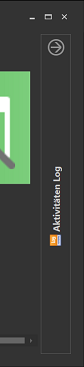
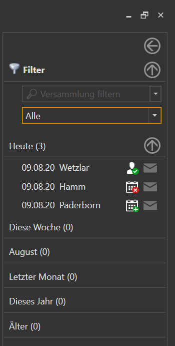

{: .align-right}

Am Rechten Rand des Programmfenster kann man ein Aktivitätslog einsehen. Aus diesem Log kann man sehen wann man bestimmte Vorgänge im Programm vorgenommen hat. Es werden nicht alle Aktivitäten gespeichert, sondern lediglich Aktionen bei denen dein Plan oder die Einladungen deiner Redner
geändert werden, oder eine Kommunikation mit anderen statt findet.

Das Aktivitäten Log kann entweder dauerhaft über den kleinen Pfeil im oberen Bereich, oder für eine kurze Info per Klick auf den Namen Aktivitäten Log geöffnet werden.

 

## Filter

Im Oberen Bereich hat man die Möglichkeit alle Aktivitäten zu filtern um bestimmte Aktivitäten schneller zu finden.
Beide Filter können einzeln oder auch in Kombination eingesetzt werden.

* Versammlungsfilter
* Aktivitäten Typ Filter

### Versammlungsfilter

Alle Einträge können auf die Aktivität einer einzigen Versammlung reduziert werden. Dazu im Auswahlfeld den Namen der Versammlung oder des Koordinator eintippen, die Autovervollständigung hilft dabei die gewünschte Versammlung schnell zu finden.

### Aktivitäten Typ Filter

Die Einträge können auch danach gefiltert werden in welchem Bereich die Aktivität statt gefunden hat.

* Alle  
  Die Einträge werden nicht gefiltert.
* Mein Plan  
  Es werden nur Einträge angezeigt, die mit der Planung deiner eigenen Versammlung in Verbindung stehen.
* Meine Redner  
  Es werden nur Einträge angezeigt, die mit der Planung deiner Redner in anderen Versammlungen zu tun haben.
* Sonstiges  
  Aktivitäten die weder zu "Mein Plan" noch zu "Meine Redner" gehören.

## Aktivitäten

### Zeitabschnitte

Alle Aktivitäten sind in Zeitabschnitte unterteilt.
* Heute
* Diese Woche (ohne den aktuellen Tag)
* Aktueller Monat (ohne Aktivitäten der aktuellen Woche, wird mit dem aktuellen Monatsnamen angezeigt)
* Letzter Monat
* Aktuelles Jahr (ohne die Aktivitäten in den oberen 4 Gruppen)
* Älter

### Die Aktivität
Jeder Eintrag wird in einer Zeile angezeigt und beinhaltet folgende Informationen:

* Das Datum an dem die Aktivität statt fand.
* Den Namen der Versammlung die die Aktivität betrifft
* Ein zusammengesetztes Symbol das die Aktivität näher beschreibt
  * Das "große Symbol in weiß" zeigt den Aktivitätsbereich an: Mein Plan, Meine Redner, Sonstiges
  * Das "kleine Symbol in Farbe" zeigt die Art der Aktivität an: Neue Eintragung, Löschung, Bearbeitung, Kommunikation
* Ein Symbol für die Mails.

Jeder der 4 Informationen verfügt über eine "Mouse-Over" Funktion. Wenn du mit der Maustaste über die Bereiche des Eintrags gehst, werden in einem PopUp weitere Detailinformationen angezeigt:
* Datum: Detailinformationen über die Aktivität
* Versammlungsname: Versammlungsname + Name des Koordinator
* Aktivität: Die Aktivität in Textform
* Mailsymbol: Den Inhalt von Mails der generiert wurde, sofern bei der Aktivität Mails generiert werden.

[zurück](ProgrammEinstellungen.md){: .btn .btn--inverse}  [weiter](Konzept.md){: .btn .btn--inverse}