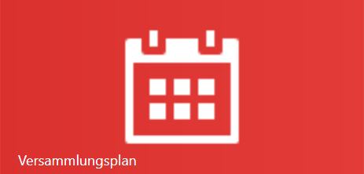
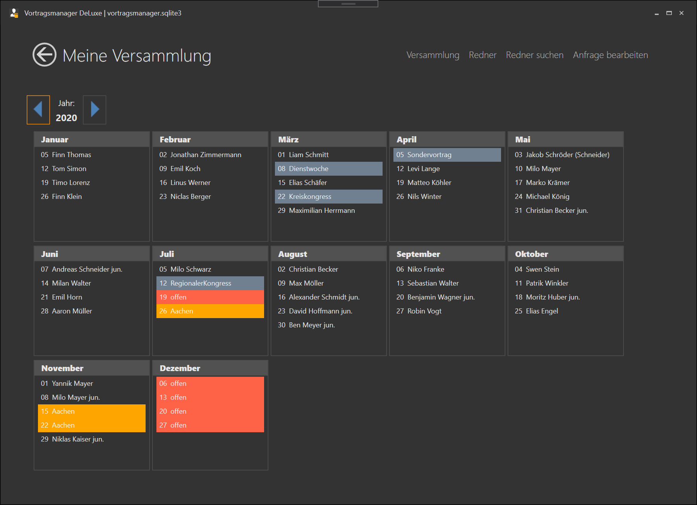
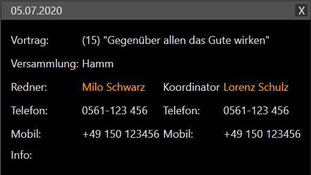
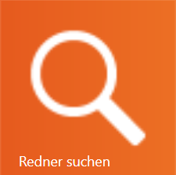

⇦ zurück zum [Inhaltsverzeichnis](README.md)

## Inhaltsverzeichnis
1. [Mein Plan](#mein-plan)
    1. [Ereignistypen](#die-ereignistypen)
    1. [Aktionen](#aktionen)
1. [Redner suchen](#redner-suchen)
1. [Antwort eintragen](#antwort-eintragen)

# Mein Plan
Die Verwaltung deiner eigenen Redner- und Vortragsplanung geschieht hier. 

Die Seite besteht aus der Jahres-Navigation in der du das aktuell betrachtete Jahr wechseln kannst und einem Jahreskalender mit allen deinen Planungen.
Für jede Woche gibt es einen Eintrag mit dem Tag im Monat und einem Hinweis auf deine Eintragung.

Eine Woche kann 4 verschiedene Stati haben. Schauen wir uns das am Beispiel des Monats Juli an: 

 * 05 Juli: [Vortragseinladung](#vortragseinladung-05-juli) von Milo Schwarz
 * 12 Juli: [Sonderereignis](#ereignisse-12-juli) Kongress
 * 19 Juli: [offen](#keine-planung-vorhanden-offen-19-juli) noch keine Planung festgelegt
 * 26 Juli: [Eine Anfrage](#laufende-anfrage-26-juli) an Versammlung Aachen steht noch aus

## Die Ereignistypen

### Vortragseinladung (05. Juli)
Bei bestehenden Vortragseinladungen wird dir der Name des Redners angezeigt. Mit einem Klick auf die Buchung werden dir weitere Details der Buchung angezeigt. 

 

Die Kontaktdaten können per klick in die Zwischenablage kopiert und in anderen Programmen eingefügt werden.

Wenn du mit der rechten Maustaste auf eine Vortragseinladung klickst wird ein Kontextmenü mit folgenden Möglichkeiten geöffnet:

* Buchung verschieben (bzw. tauschen)
* Buchung bearbeiten
* Buchung löschen

### Ereignisse (12. Juli)

Im Vortragsmanager können folgende Ereignisse eingetragen werden:

* Dienstwoche
* Regionaler Kongress
* Kreiskongress
* Streaming
* Sonstiges

Abhängig von dem jeweiligen Ereignis können weitere Informationen gespeichert werden, die später beim generieren des Aushangs mit Ausgegeben werden.

Bei einem Klick auf ein Ereignis öffnet sich ein Fenster in dem das Ereignis bearbeitet werden kann.

Wenn du mit der rechten Maustaste auf ein Ereignis klickst, wird ein Kontextmenü mit folgenden Möglichkeiten geöffnet:

* Ereignis bearbeiten
* Buchung verschieben (bzw. tauschen)
* Buchung bearbeiten
* Buchung löschen

### Keine Planung vorhanden (offen, 19. Juli)

Klickst du auf eine Woche in der noch keine Planung eingetragen ist, wirst du direkt zur Rednersuche weitergeleitet.

Wenn du mit der rechten Maustaste das Kontextmenü öffnest, hast du folgende Möglichkeiten:

* Redner suchen (Standard-Aktion die mit der linken Maustaste ausgelöst wird)
* Vortrag eintragen (hier werden die Mails und der Status Anfrage direkt übersprungen und ein Vortrag sofort eingetragen, z.B. wenn du bereits einen Vortrag per Telefon abgesprochen hast und ihn lediglich in deiner Planung eintragen möchtest)-
* Ereignis eintragen

### laufende Anfrage (26. Juli)

Anfragen an Koordinatoren werden in dem Jahresplan mit dem Namen der Versammlung an die diese Anfrage gestellt wurde angezeigt.

Mit einem Klick auf die Anfrage wird ein Dialog geöffnet, in dem du die Anfrage bearbeiten kannst.

Anfragen haben kein Kontextmenü

## Aktionen

Im Fenster Mein Plan können folgende Aktionen durchgeführt werden:

### Buchung verschieben (bzw. tauschen)
Vorträge und Ereignisse können verschoben werden.
Das verschieben geschieht über das [Kontextmenü](Konzept.md#kontextmenü) .

In diesem Beispiel habe ich auf die Buchung am 29.03.2020 geklickt (meine Startbuchung). Ich wähle dann das Zieldatum aus, auf das ich diese Buchung verschieben möchte. Ist an dem Zieldatum kein Eintrag vorhanden, kann man die Änderung Speichern oder die Aktion wieder Abbrechen.
Ist an dem Zieldatum bereits eine Buchung vorhanden, wird sie im Dialog angezeigt und man kann entscheiden ob man den bisherigen Eintrag am Zieldatum löschen oder mit dem aktuellen Ereignis tauschen möchte.
Nach dem bestätigen werden [Mailtexte](Konzept.md#mailtexte) an die betroffenen Redner oder Koordinatoren generiert.

### Buchung bearbeiten
Vorträge 

### Buchung löschen

### Ereignis bearbeiten

### Anfrage "bearbeiten"

# Redner suchen #

UNDER CONSTRUCTION

# Antwort eintragen #

UNDER CONSTRUCTION

⇦ zurück zum [Inhaltsverzeichnis](README.md)