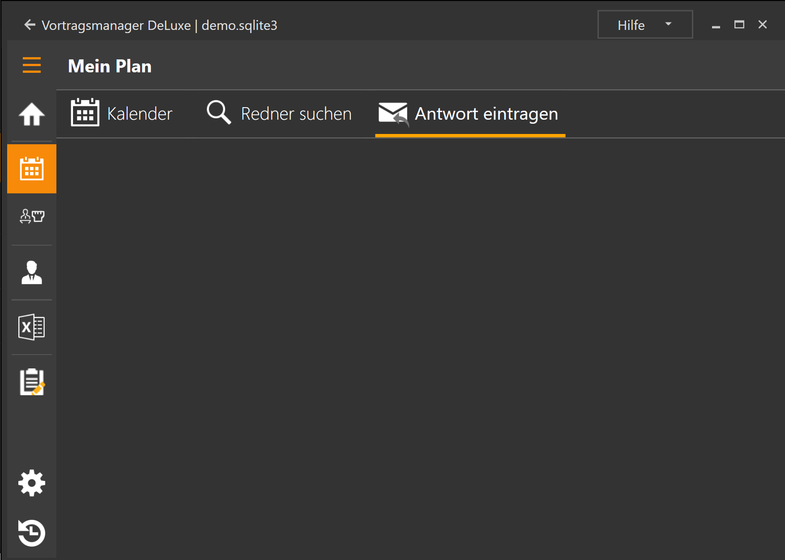

Die Verwaltung deiner eigenen Redner- und Vortragsplanung geschieht hier. 
Dieser Programmbereich besteht aus drei Unterbereichen:

* [Kalender](MeinPlanKalender.md): Dies ist der Hauptbereich für deine Planung. Hier siehst du deine aktuelle Planung und kannst sie auch pflegen.
* [Redner suchen](MeinPlanRednerSuchen.md): Hier findest du die Vorträge und Redner die du schon länger nicht mehr gehört hast und kannst Einladungsmails generieren.
* [Antwort eintragen](MeinPlanAntwortEintragen.md): Hat jemand auf deine Einladung geantwortet, trägst du hier die Antwort ein. Dein Versammlungsplan wird dann aktualisiert.

[zurück](Startseite.md){: .btn .btn--inverse}  [weiter](MeinPlanKalender.md){: .btn .btn--inverse}