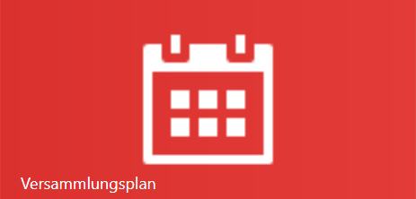
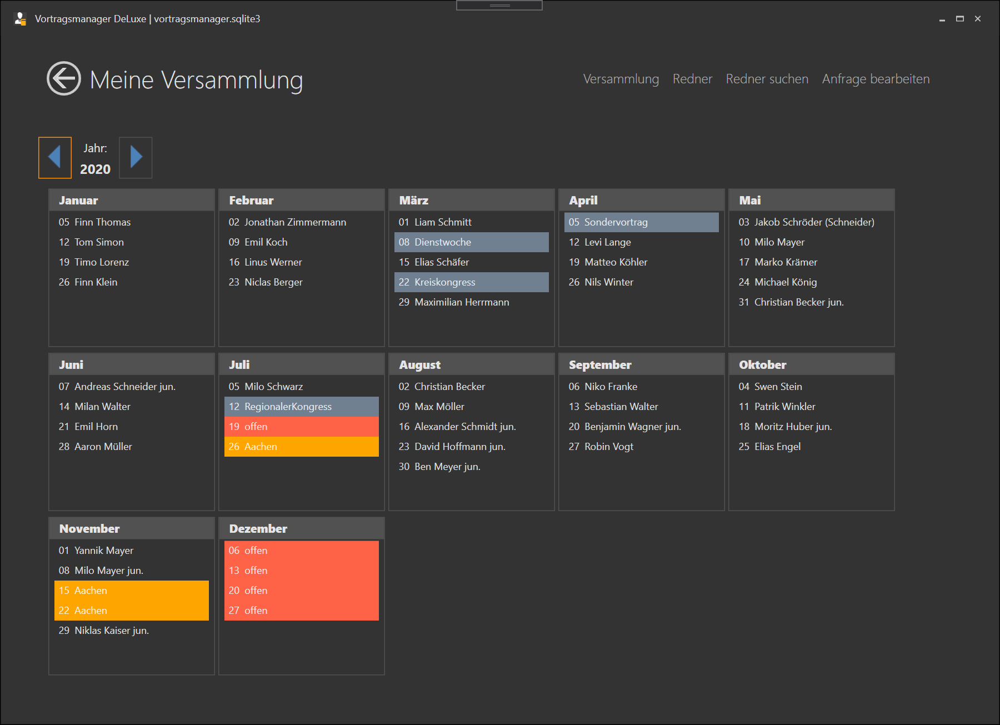
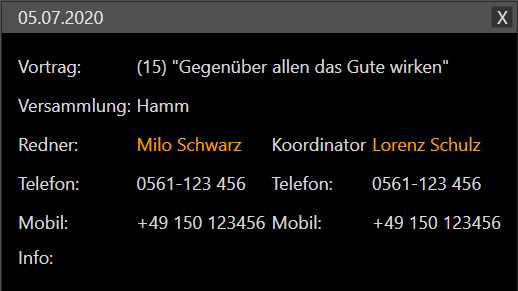
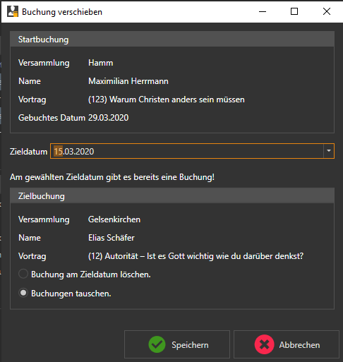
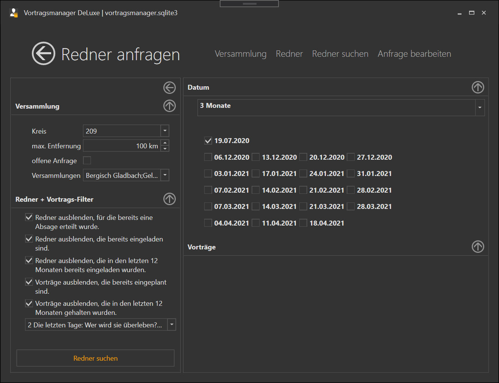
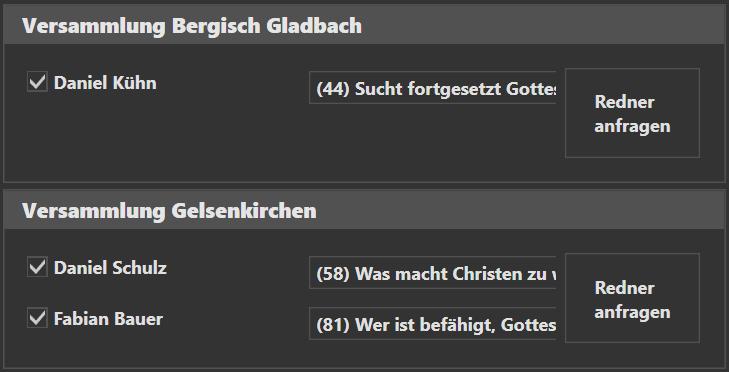
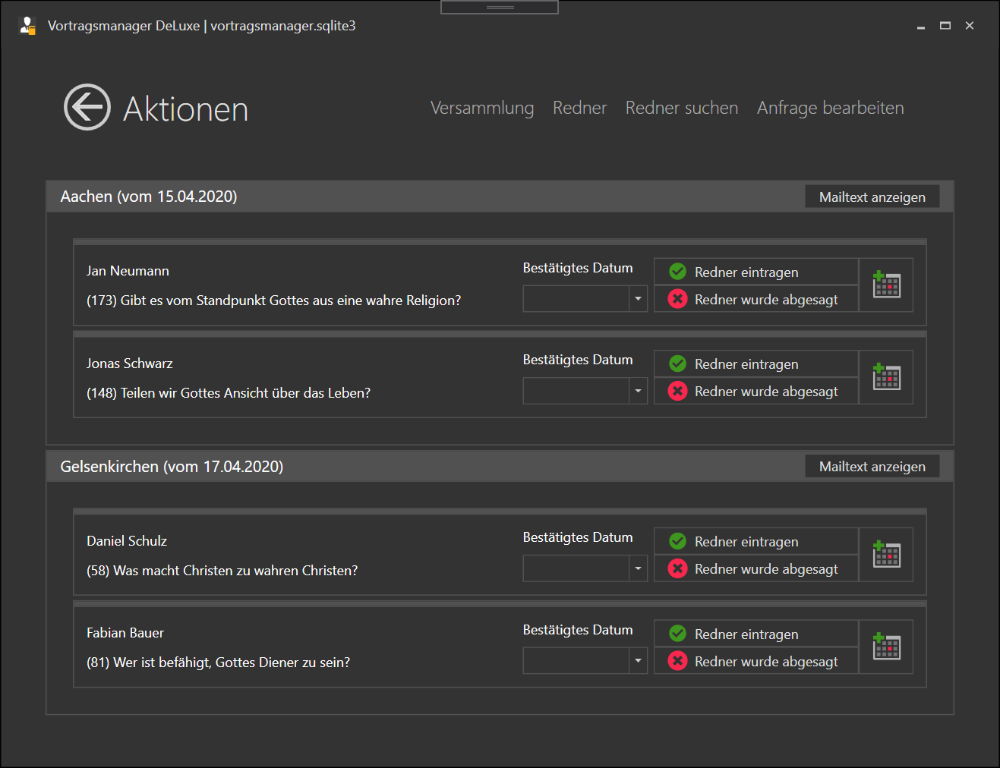

Die Verwaltung deiner eigenen Redner- und Vortragsplanung geschieht hier. 

Die Seite besteht aus der Jahres-Navigation in der du das aktuell betrachtete Jahr wechseln kannst und einem Jahreskalender mit allen deinen Planungen.
Für jede Woche gibt es einen Eintrag mit dem Tag im Monat und einem Hinweis auf deine Eintragung.

Eine Woche kann 4 verschiedene Stati haben. Schauen wir uns das am Beispiel des Monats Juli an: 

 * 05 Juli: [Vortragseinladung](#vortragseinladung-05-juli) von Milo Schwarz
 * 12 Juli: [Sonderereignis](#ereignisse-12-juli) Kongress
 * 19 Juli: [offen](#keine-planung-vorhanden-offen-19-juli) noch keine Planung festgelegt
 * 26 Juli: [Eine Anfrage](#laufende-anfrage-26-juli) an Versammlung Aachen steht noch aus

## Die Ereignistypen

### Vortragseinladung (05. Juli)
Bei bestehenden Vortragseinladungen wird dir der Name des Redners angezeigt. Mit einem Klick auf die Buchung werden dir weitere Details der Buchung angezeigt. 

 

Die Kontaktdaten können per klick in die Zwischenablage kopiert und in anderen Programmen eingefügt werden.

Wenn du mit der rechten Maustaste auf eine Vortragseinladung klickst wird ein Kontextmenü mit folgenden Möglichkeiten geöffnet:

* Buchung verschieben (bzw. tauschen)
* Buchung bearbeiten
* Buchung löschen
* Erinnerungsmail senden

### Ereignisse (12. Juli)

Im Vortragsmanager können folgende Ereignisse eingetragen werden:

* Dienstwoche
* Regionaler Kongress
* Kreiskongress
* Streaming
* Sonstiges

Abhängig von dem jeweiligen Ereignis können weitere Informationen gespeichert werden, die später beim generieren des Aushangs mit Ausgegeben werden.

Bei einem Klick auf ein Ereignis öffnet sich ein Fenster in dem das Ereignis bearbeitet werden kann.

Wenn du mit der rechten Maustaste auf ein Ereignis klickst, wird ein Kontextmenü mit folgenden Möglichkeiten geöffnet:

* Ereignis bearbeiten
* Buchung verschieben (bzw. tauschen)
* Buchung bearbeiten
* Buchung löschen

### Keine Planung vorhanden (offen, 19. Juli)

Klickst du auf eine Woche in der noch keine Planung eingetragen ist, wirst du direkt zur Rednersuche weitergeleitet.

Wenn du mit der rechten Maustaste das Kontextmenü öffnest, hast du folgende Möglichkeiten:

* Redner suchen (Standard-Aktion die mit der linken Maustaste ausgelöst wird)
* Vortrag eintragen (hier werden die Mails und der Status Anfrage direkt übersprungen und ein Vortrag sofort eingetragen, z.B. wenn du bereits einen Vortrag per Telefon abgesprochen hast und ihn lediglich in deiner Planung eintragen möchtest)-
* Ereignis eintragen

### laufende Anfrage (26. Juli)

Anfragen an Koordinatoren werden in dem Jahresplan mit dem Namen der Versammlung an die diese Anfrage gestellt wurde angezeigt.

Mit einem Klick auf die Anfrage wird ein Dialog geöffnet, in dem du die Anfrage bearbeiten kannst.

Anfragen haben kein Kontextmenü

## Aktionen

Im Fenster Mein Plan können folgende Aktionen durchgeführt werden:

### Buchung verschieben (bzw. tauschen)
Vorträge und Ereignisse können verschoben werden.
Das verschieben geschieht über das [Kontextmenü](Konzept.md#kontextmenü) .

In diesem Beispiel habe ich auf die Buchung am 29.03.2020 geklickt (meine Startbuchung). Ich wähle dann das Zieldatum aus, auf das ich diese Buchung verschieben möchte. Ist an dem Zieldatum kein Eintrag vorhanden, kann man die Änderung Speichern oder die Aktion wieder Abbrechen.
Ist an dem Zieldatum bereits eine Buchung vorhanden, wird sie im Dialog angezeigt und man kann entscheiden ob man den bisherigen Eintrag am Zieldatum löschen oder mit dem aktuellen Ereignis tauschen möchte.
Ist an dem Zieldatum eine Aktive Anfrage vorhanden, wird diese gelöscht.
Nach dem bestätigen werden [Mailtexte](Konzept.md#mailtexte) an die betroffenen Redner oder Koordinatoren generiert.

### Buchung bearbeiten
Vorträge und Ereignisse können nachträglich bearbeitet werden.

#### Vorträge
Du kannst den Redner und den Vortrag ändern. Es wird für diese Änderung jedoch kein Mailtext generiert.

#### Ereignisse
Du kannst den Ereignis-Typ, den Namen des Redners sowie den Titel des Vortrags nachträglich ändern, sofern das Ereigniss alle diese Parameter unterstützt.

#### Anfragen
Man kommt hier zu dem Dialog [Antwort eintragen](#antwort-eintragen) der weiter unten beschrieben wird.

### Buchung löschen
Du kannst Vorträge und Ereignisse löschen.
Beim Löschen von Vorträgen wird ein Mailtext generiert, Ereignisse werden sofort gelöscht.

### Erinnerungsmail senden
Du kannst für eine bevorstehende Vortragseinladung eine Erinnerungsmail senden.

# Redner suchen #

Eine der häufigsten Tätigkeiten ist es, nach Vorträgen und Rednern für die eigene Versammlung zu suchen. Die Suchfunktion wird über das Menü auf der Startseite, oder per [Kontextmenü](Konzept.md#Kontextmenü) in dem Fenster "Mein Plan" einer offenen Woche aufgerufen.

Das Fenster besteht aus 3 Bereichen.

1. Filter
2. Datum
3. Rednerauswahl

## Filter
Du kannst die zu suchenden Redner nach folgenden Kriterien Filtern:

1. Versammlungen

    1. Kreis:  
    Suche nur Versammlungen und Redner im Kreis XXX, eine Mehrfachauswahl ist hier möglich.
    2. max. Entfernung  
    Alle Versammlungen auf die Entfernung filtern. Versammlungen die weiter weg sind als hier angegeben, werden bei der Suche nicht berücksichtigt.
    3. offene Anfrage:
    Versammlungen bei denen noch Anfragen ausstehen werden bei der Suche nicht berücksichtigt.
    4. Versammlungen:  
    Das Auswahlfeld berücksichtigt bereits die Filter 1-3. Hier werden also nur die Versammlungen angezeigt, die den bisherigen Suchkriterien entsprechen. Zusätzlich können hier weitere Versammlungen aus der Suche entfernt werden.

2. Redner + Vortrags-Filter 

    1. Redner ausblenden, für die bereits eine Absage erteilt wurde. Der Filter ist für die entsprechenden Redner aktiv, bis das Datum der Absage erreicht ist.
    2. Redner ausblenden, die bereits in der Zukunft eingeladen sind (in der Zukunft).
    3. Redner ausblenden, die in den letzten 12 Monaten bereits eingeladen wurden
    4. Vorträge ausblenden, die bereits eingeplant sind (in der Zukunft).
    5. Vorträge ausblenden, die in den letzten 12 Monaten bereits gehalten wurden.
    6. Vorträge:  
    Das Auswahlfeld berücksichtigt bereits die Filter 4+5. Hier werden also nur noch die Vorträge angezeigt, die den bisherigen Suchkriterien entsprechen.

### Datumsauswahl
Als nächstes solltest du prüfen für welche deiner freien Planungen du eine Anfrage an einen Koordinator schicken willst.
Es gibt mehrere vorgespeicherte Sets, wie
* alle offenen Planungen der nächsten 1/3/6/12 Monate.
* nur für den nächsten freien Termin.

Die Änderungen siehst du direkt an dem Hacken neben den einzelnen Wochen, die sich abhängig von deiner Auswahl verändern.

Zusätzlich kannst du hier nun einzelne Wochen hinzunehmen oder abwählen.

### Suchen
hast du deine Filter eingestellt, kannst du unten links auf "Redner suchen" klicken.

Die Ergebnisse werden sofort rechts unterhalb des Datumfeldes angezeigt.

### Suchergebnisse

In diesem Beispiel wurden zwei Versammlungen gefunden, die den Suchkriterien entsprechen bzw. deren Redner den Kriterien entsprechen.
Du musst dich nun entscheiden welche der Versammlungen du für die oben markierten Wochen nach einem oder mehreren Redner(n) angefragt werden soll.

Sollten mehrere Redner einer Versammlung den Kriterien entsprechen, können sie alle in einer Anfrage angefragt werden. Oder du entfernst den Hacken links neben dem Namen und der Redner wird bei seinem Koordinator nicht angefragt. 

Auch den zu haltenden Vortrag kannst du je Redner abändern.
Im Suchfeld werden dir mehrere Informationen zu jedem Vortrag des Redners angezeigt:
1. die Vortragsnummer
1. das Thema
1. Wie oft der Vortrag in deiner Versammlung bereits gehört wurde
1. Wann dieser Vortrag das letzte mal gehalten wurde (egal von welchem Redner)

Hast du alles nach deinen Wünschen eingestellt, kannst du auf "Redner anfragen" klicken.
Es wird dir nun der generierte Mailtext für deine Anfrage angezeigt, denn du wieder nach jwpub.org kopierst.

Im Hintergrund wird die Anfrage abgespeichert, eine weitere Suche nach Rednern würde jetzt also die Versammlung und angefragten Redner genauso herausfiltern wie der gewählte Redner und Vortragsthema.

Ist die Anfrage erstellt und mit jwpub.org versendet, heißt es warten bis der Koordinator sich wieder meldet. 

# Antwort eintragen #

Hier werden dir alle offenen Anfragen angezeigt.

In diesem Beispiel gibt es aktuell zwei nicht beantwortete Anfragen:
 
* Eine Anfrage vom 15.04. an Versammlung Aachen
* Eine zweite Anfrage vom 17.04. an Versammlung Gelsenkirchen.

In beiden Anfragen wurden jeweils 2 Redner mit ihren Vorträgen angefragt. 

Hat der Koordinator dir geantwortet, das der Redner für die Woche XX zur verfügung steht, trage das Datum im Feld "Bestätigtes Datum" ein und klicke auf "Redner eintragen".

Hat der Koordinator dir geantwortet, das der Redner an den angefragten Wochen nicht verfügbar ist, kannst du auf den roten Button "Redner wurde abgesagt" klicken. Der Redner wird dann aus der Anfrage entfernt.

Hat der Koordinator die geantwortet, das der Redner an den angefragten Wochen nicht verfügbar ist, aber dir einen alternativ-Termin genannt - und dieser ist bei dir frei, kannst du auf das Kalendersymbol klicken. Im Auswahlfeld "Bestätigtes Datum" werden nun alle freien Termine deiner Planung der nächsten 12 Monate     angezeigt, aus denen du das entsprechende Datum auswählen kannst.

Außerdem hast du hier die Möglichkeit den Original-Mailtext der generiert wurde nochmal anzeigen zu lassen.

Dieser Dialog kann auch über "Mein Plan" aufgerufen werden. Wählt man hier eine offene Anfrage und dann über das Kontextmenü "bearbeiten" aus, wird der gleiche Dialog geöffnet, aber nur die relevante Anfrage angezeigt.

[zurück](Installation.md){: .btn .btn--inverse}  [weiter](AntwortEintragen.md){: .btn .btn--inverse}