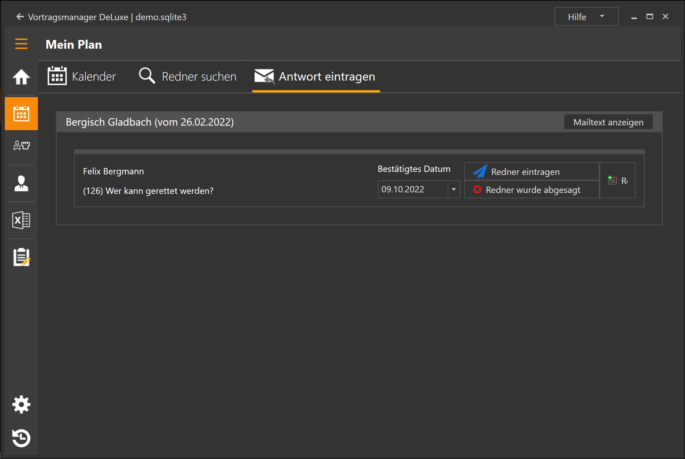

Hier werden dir alle offenen Anfragen angezeigt.

In diesem Beispiel gibt es eine nicht beantwortete Anfrage:
 
* Gestellt am 26.02.2022 an Bergisch Gladbach

In dieser Anfrage wurden nur 1 Redner mit seinen Vorträgen angefragt. 

Hat der Koordinator dir geantwortet, das der Redner für die Woche XX zur Verfügung steht, trage das Datum im Feld "Bestätigtes Datum" ein und klicke auf "Redner eintragen".

Hat der Koordinator dir geantwortet, das der Redner an den angefragten Wochen nicht verfügbar ist, kannst du auf den roten Button "Redner wurde abgesagt" klicken. Der Redner wird dann aus der Anfrage entfernt.

Hat der Koordinator die geantwortet, das der Redner an den angefragten Wochen nicht verfügbar ist, aber dir einen alternativ-Termin genannt - und dieser ist bei dir frei, kannst du auf das Kalendersymbol klicken. Im Auswahlfeld "Bestätigtes Datum" werden nun alle freien Termine deiner Planung der nächsten 12 Monate     angezeigt, aus denen du das entsprechende Datum auswählen kannst.

Außerdem hast du hier die Möglichkeit den Original-Mailtext der generiert wurde nochmal anzeigen zu lassen.

Dieser Dialog kann auch über "Kalender" aufgerufen werden. Wählt man hier eine offene Anfrage und dann über das Kontextmenü "bearbeiten" aus, wird der gleiche Dialog geöffnet, aber nur die relevante Anfrage angezeigt.

[zurück](MeinPlanRednerSuchen.md){: .btn .btn--inverse}  [weiter](MeinPlanVorsitzUndLeser.md){: .btn .btn--inverse}