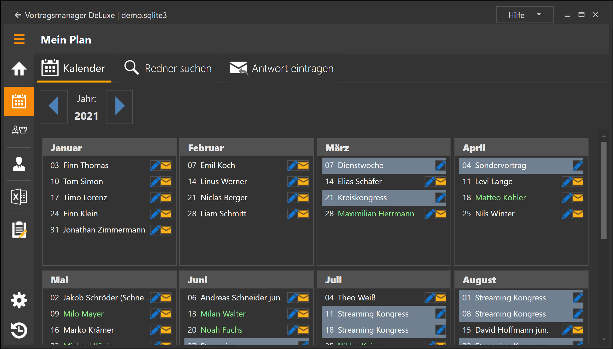

Die Seite besteht aus der Jahres-Navigation in der du das aktuell betrachtete Jahr wechseln kannst und einem Jahreskalender mit allen deinen Planungen.
Für jede Woche gibt es einen Eintrag mit dem Tag im Monat und einem Hinweis auf deine Eintragung.

Eine Woche kann 4 verschiedene Stati haben. Schauen wir uns das am Beispiel des Monats Oktober an: 

 * 03 Oktober: [Vortragseinladung](#vortragseinladung-03-oktober) von Michael König
 * 10 Oktober: [Eine Anfrage](#laufende-anfrage-10-oktober) an Versammlung Bottrop steht noch aus
 * 24 Oktober: [Sonderereignis](#ereignisse-24-oktober) Dienstwoche
 * 31 Oktober: [offen](#keine-planung-vorhanden-offen-31-oktober) noch keine Planung festgelegt

## Die Ereignistypen

### Vortragseinladung (03. Oktober)
Bei bestehenden Vortragseinladungen wird dir der Name des Redners angezeigt. Mit einem Klick auf die Buchung werden dir weitere Details der Buchung angezeigt. 

 

Die Kontaktdaten können per klick in die Zwischenablage kopiert und in anderen Programmen eingefügt werden.

Wenn du neben der Vortragseinladung auf Bearbeiten (Blauer Stift) klickst wird ein Menü mit folgenden Möglichkeiten geöffnet:

* Buchung verschieben (bzw. tauschen)
* Buchung bearbeiten
* Buchung löschen
* Erinnerungsmail senden

Außerdem wird neben jeder Vortragseinladung ein Brief-Symbol angezeigt.
* Ein geschlossener Umschlag weist darauf hin, das noch keine Erinnerungsmail versendet wurde.
* Ein geöffneter Umschlag zeigt dir, das die Erinnerungsmail bereits mindestens 1x versendet wurde.
Mit einem Klick auf den Umschlag kann eine (weitere) Erinnerungsmail generiert werden.

### laufende Anfrage (10. Oktober)

Anfragen an Koordinatoren werden in dem Jahresplan mit dem Namen der Versammlung an die diese Anfrage gestellt wurde angezeigt.

Mit einem Klick auf die Anfrage wird ein Dialog geöffnet, in dem du die Anfrage bearbeiten kannst.

### Ereignisse (24. Oktober)

Im Vortragsmanager können folgende Ereignisse eingetragen werden:

* Dienstwoche
* Regionaler Kongress
* Kreiskongress
* Streaming
* Sonstiges

Abhängig von dem jeweiligen Ereignis können weitere Informationen gespeichert werden, die später beim generieren des Aushangs mit Ausgegeben werden.

Bei einem Klick auf ein Ereignis öffnet sich ein Fenster in dem das Ereignis bearbeitet werden kann.

Wenn du neben dem Ereignis auf Bearbeiten (Blauer Stift) klickst, wird ein Menü mit folgenden Möglichkeiten geöffnet:

* Ereignis bearbeiten
* Buchung verschieben (bzw. tauschen)
* Buchung bearbeiten
* Buchung löschen

### Keine Planung vorhanden (offen, 31. Oktober)

Klickst du auf eine Woche in der noch keine Planung eingetragen ist, wirst du direkt zur Rednersuche weitergeleitet.

Über das Bearbeiten-Symbol hast du folgende Möglichkeiten:

* Redner suchen (Standard-Aktion die mit der linken Maustaste ausgelöst wird)
* Vortrag eintragen (hier werden die Mails und der Status Anfrage direkt übersprungen und ein Vortrag sofort eingetragen, z.B. wenn du bereits einen Vortrag per Telefon abgesprochen hast und ihn lediglich in deiner Planung eintragen möchtest)-
* Ereignis eintragen

## Aktionen

Im Fenster "Kalender"" können folgende Aktionen durchgeführt werden:

### Buchung verschieben (bzw. tauschen)
Vorträge und Ereignisse können verschoben werden.
Das verschieben geschieht über das [Kontextmenü](Konzept.md#kontextmenü) .

In diesem Beispiel habe ich auf die Buchung am 29.03.2020 geklickt (meine Startbuchung). Ich wähle dann das Zieldatum aus, auf das ich diese Buchung verschieben möchte. Ist an dem Zieldatum kein Eintrag vorhanden, kann man die Änderung Speichern oder die Aktion wieder Abbrechen.
Ist an dem Zieldatum bereits eine Buchung vorhanden, wird sie im Dialog angezeigt und man kann entscheiden ob man den bisherigen Eintrag am Zieldatum löschen oder mit dem aktuellen Ereignis tauschen möchte.
Ist an dem Zieldatum eine Aktive Anfrage vorhanden, wird diese gelöscht.
Nach dem bestätigen werden [Mailtexte](Konzept.md#mailtexte) an die betroffenen Redner oder Koordinatoren generiert.

### Buchung bearbeiten
Vorträge und Ereignisse können nachträglich bearbeitet werden.

#### Vorträge
Du kannst den Redner und den Vortrag ändern. Es wird für diese Änderung jedoch kein Mailtext generiert.

#### Ereignisse
Du kannst den Ereignis-Typ, den Namen des Redners sowie den Titel des Vortrags nachträglich ändern, sofern das Ereigniss alle diese Parameter unterstützt.

#### Anfragen
Man kommt hier zu dem Dialog [Antwort eintragen](#antwort-eintragen) der weiter unten beschrieben wird.

### Buchung löschen
Du kannst Vorträge und Ereignisse löschen.
Beim Löschen von Vorträgen wird ein Mailtext generiert, Ereignisse werden sofort gelöscht.

### Erinnerungsmail senden
Du kannst für eine bevorstehende Vortragseinladung eine Erinnerungsmail senden.

[zurück](MeinPlan.md){: .btn .btn--inverse}  [weiter](MeinPlanRednerSuchen.md){: .btn .btn--inverse}