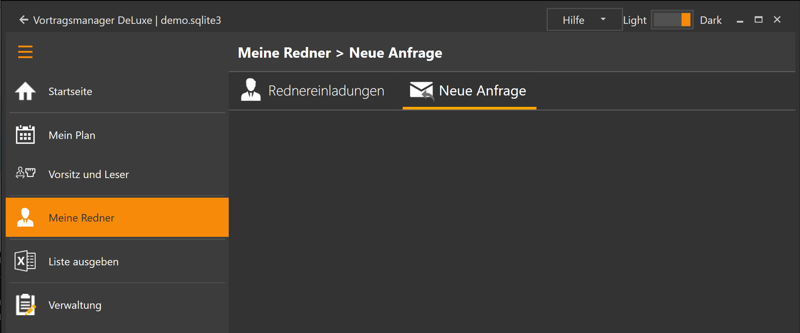

Dieser Programmbereich besteht aus zwei Unterbereichen:

* [Rednereinladungen](MeineRedner.md): Hier siehst du die Vortragstermine aller deiner Redner
* [Neue Anfrage](MeineRednerNeueAnfrage.md): Fragt eine andere Versammlung einen Redner an, kannst du hier prüfen ob er zur Verfügung steht und in deine Planung eintragen.

[zurück](MeinPlanVorsitzUndLeser.md){: .btn .btn--inverse}  [weiter](MeineRednerRednereinladungen.md){: .btn .btn--inverse}