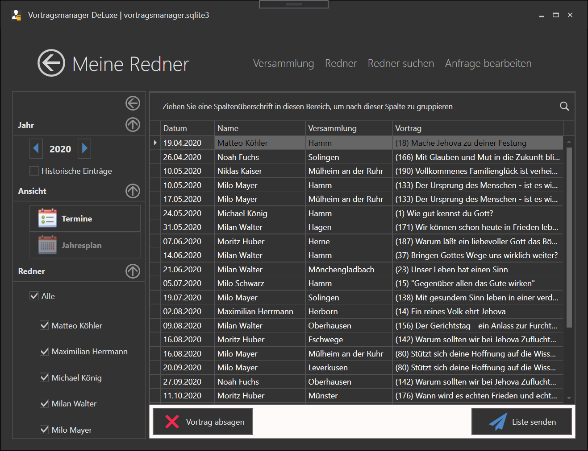
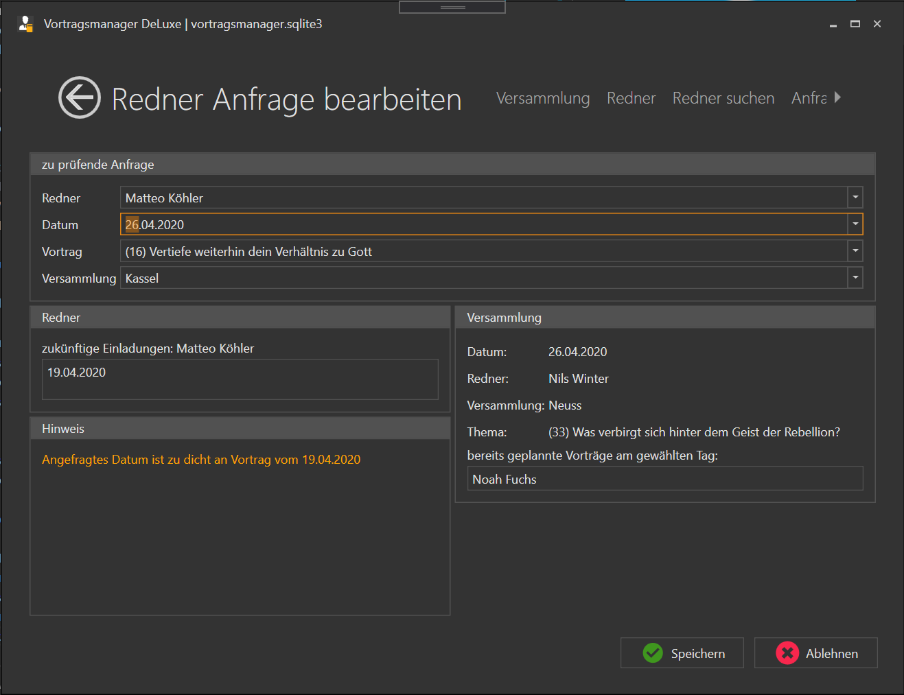

⇦ zurück zum [Inhaltsverzeichnis](README.md)

## Inhaltsverzeichnis
1. [Meine Redner](#meine-redner)
    1. [Filtern](#filter)
    2. [Bearbeiten](#bearbeiten)
    3. [Ausgeben](#ausgeben)
1. [Neue externe Anfrage](neue-externe-anfrage)

# Meine Redner #

Eine Liste aller Einlaungen meiner Redner. Diese Liste kann hier gefiltert bearbeitet und ausgegeben werden.

## Filter

im linken Fensterbereich kann die Vortragsliste gefiltert werden.

1. Jahr  
    Auswahl des Jahres für das die Einladungen angezeigt werden soll. Das Jahr kann durch einen Klick auf den blauen Pfeil zurück- oder vorgestetllt werden.

1. Historische Einträge  
    Es werden nur die Zukünftigen Einladungen deiner Redner angezeigt. Möchtest du auch die Einladungen der vorherigen Monate anzeigen, kannst du dies hier aktivieren.

1. Ansicht  
    Dieser Bereich ist noch nicht programmiert und aktuell ohne Funktion.

1. Redner  
    Hier kann die Liste z.B. auf einzelne Redner eingeschränkt werden. Das ist nützlich, möchte man einem Redner eine Liste aller seiner Einladungen zusenden.

## Bearbeiten

Der größte Bereich des Fensters zeigt die Liste aller Einladungen deiner Redner an. Du siehst hier:

1. Das Datum der Einladung
1. Den Namen des eingeladenen Redner
1. welche Versammlung ihn eingeladen hat
1. welchen Vortrag er halten soll

wählst du einen Vortrag aus, kannst du über den Button unten links den Vortrag wieder absagen. Es wird eine entsprechende Mail generiert und angezeigt.

Das verändern einzelner Parameter, wie z.B. des Vortragsthema ist nicht möglich. Hier musst du zuerst die Einladung löschen und dann über den Menüpunkt [Neue Externe Anfrage](neue-externe-anfrage) neu einstellen.

## Ausgeben

Möchtest du eine Info Mail mit allen ausstehenden Vorträgen an einen oder mehrere Redner versenden, kannst du die Funktion unten rechts benutzen: "Liste senden". Es wird immer die gesamte Liste versendet die angezeigt wird, über die Filterfunktion im linken Fensterbereich kannst du sie dir aber individuell zusammenstellen.

# Neue Externe Anfrage #

bekommst du eine Anfrage für eine Einladung von einem anderen Koordinator, kannst du sie hier prüfen und dann Bestätigen oder ablehnen. Sowohl für die Bestätigung als auch für die Ablehnung der Anfrage werden Mailtexte an den Anfragenden Koordinator und - bei Bestätigung - an den eingelaenen Redner generiert.
Nach Bestätigung oder Ablehnung der Anfrage bleibt das Fenster offen, so dass weitere Anfragen bearbeitet werden können.

Dieser Menüpunkt besteht aus 4 Bereichen

1. [zu prüfende Anfrage](#zu-prüfende-anfrage)
2. [Redner](#redner)
3. [Versammlung](#versammlung)
4. [Hinweise](#hinweise)

## zu prüfende Anfrage

im oberen Bereich müssen die 4 Felder ausgefüllt werden:

1. Angefragter Redner
2. Das Datum der Anfrage
3. Welcher Vortrag wurde angefragt
4. Name der anfragenden Versammlung

Sind alle Felder ausgewählt, wird geprüft ob die Einladung bestätigt werden kann. Dabei wird geprüft ob sie aus Sicht des Redners als auch aus Sicht der Versammlung ok ist.

## Redner

Ein Redner soll höchstens einmal im Monat einen auswärtigen Vortrag halten um mit den Verkündigern seiner Versammlung genug Kontakt halten zu können. In diesem Bereich werden die Vortragsbuchungen Vor und Nach dem angefragten Datum angezeigt.
In diesem Beispiel hat Bruder Köhler bereits 1 Einladung am 19.04.

## Versammlung

Hier wird angezeigt wer an diesem Datum in deiner eigenen Versammlung den Vortrag hält. Wichtig ist das Feld "bereits geplannte Vorträge am gewählten Tag". Es ist darauf zu achten, das nicht zu viele Älteste am gleichen Tag einen Vortrag halten. In unserer Versammlung soll z.B. immer max. 1 Redner gleichzeitig auswärts einen Vortrag halten.

## Hinweise

Kommte es bei der Prüfung für den Redner oder für die Versammlung zu Problemen, werden dir hier entsprechende Hinweise ausgegeben. In diesem Beispiel hat der Redner bereits 1 Woche zuvor einen Vortrag und der Abstand von 1 Monat wurde nicht eingehalten. 

⇦ zurück zum [Inhaltsverzeichnis](README.md)