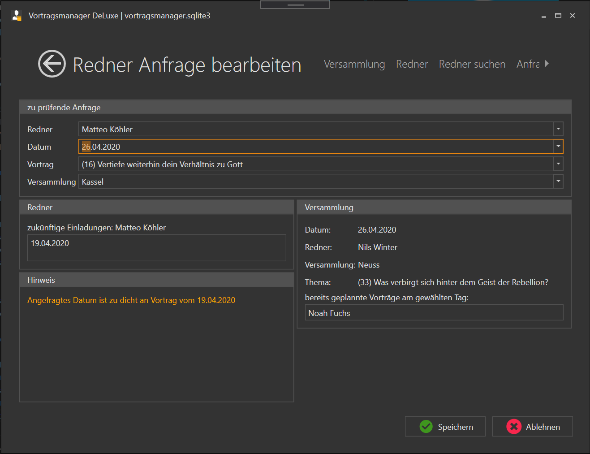

Dieser Programmbereich besteht aus zwei Unterbereichen:

* [Rednereinladungen](MeineRedner.md): Hier siehst du die Vortragstermine aller deiner Redner
* [Neue Anfrage](MeineRednerNeueAnfrage.md): Fragt eine andere Versammlung einen Redner an, kannst du hier prüfen ob er zur Verfügung steht und in deine Planung eintragen.

# Neue Anfrage

bekommst du eine Anfrage für eine Einladung von einem anderen Koordinator, kannst du sie hier prüfen und dann Bestätigen oder ablehnen. Sowohl für die Bestätigung als auch für die Ablehnung der Anfrage werden Mailtexte an den Anfragenden Koordinator und - bei Bestätigung - an den eingelaenen Redner generiert.
Nach Bestätigung oder Ablehnung der Anfrage bleibt das Fenster offen, so dass weitere Anfragen bearbeitet werden können.

Dieser Menüpunkt besteht aus 5 Bereichen

1. [zu prüfende Anfrage](#zu-prüfende-anfrage)
2. [Anfragende Versammlung](#versammlungextern)
3. [Redner](#redner)
4. [Deine Versammlung](#versammlung)
5. [Hinweise](#hinweise)

## zu prüfende Anfrage

im oberen Bereich müssen die 4 Felder ausgefüllt werden:

1. Angefragter Redner
2. Das Datum der Anfrage
3. Welcher Vortrag wurde angefragt
4. Name der anfragenden Versammlung

Sind alle Felder ausgewählt, wird geprüft ob die Einladung bestätigt werden kann. Dabei wird geprüft ob sie aus Sicht des Redners als auch aus Sicht der Versammlung ok ist.

## Versammlung (extern)
Hier werden einige weitere Informationen zur Anfragenden Versammlung angezeigt:
1. Versammlungszeit
2. Entfernung in km (von deinem Saal zum Saal der Versammlung)
3. Anschrift der Versammlung

## Redner

Ein Redner soll höchstens einmal im Monat einen auswärtigen Vortrag halten um mit den Verkündigern seiner Versammlung genug Kontakt halten zu können. In diesem Bereich werden die Vortragsbuchungen Vor und Nach dem angefragten Datum angezeigt.
In diesem Beispiel hat Bruder Köhler bereits 1 Einladung am 19.04.

## Versammlung

Hier wird angezeigt wer an diesem Datum in deiner eigenen Versammlung den Vortrag hält. Wichtig ist das Feld "bereits geplannte Vorträge am gewählten Tag". Es ist darauf zu achten, das nicht zu viele Älteste am gleichen Tag einen Vortrag halten. In unserer Versammlung soll z.B. immer max. 1 Redner gleichzeitig auswärts einen Vortrag halten.

## Hinweise

Kommte es bei der Prüfung für den Redner oder für die Versammlung zu Problemen, werden dir hier entsprechende Hinweise ausgegeben. In diesem Beispiel hat der Redner bereits 1 Woche zuvor einen Vortrag und der Abstand von 1 Monat wurde nicht eingehalten. 

[zurück](MeineRedner.md){: .btn .btn--inverse}  [weiter](ListeAusgeben.md){: .btn .btn--inverse}