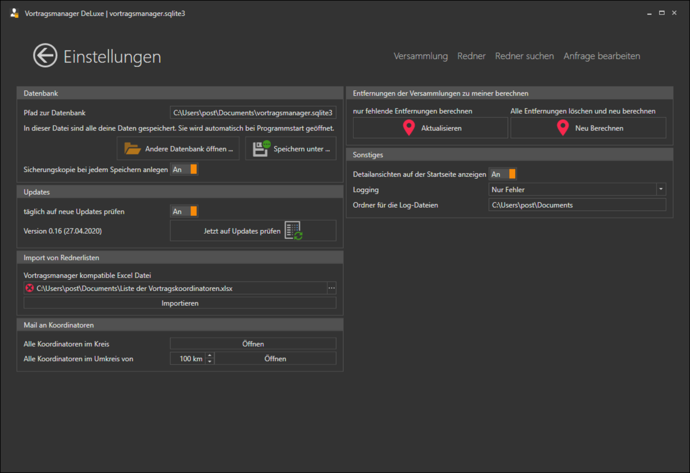

# Programm #

Im Bereich Programm werden einige Programmweite Einstellungen vorgenommen, als auch Aktionen durchgeführt die sehr selten benötigt werden.

## Datenbank

Hier kann der Pfad zur Programmmanager-Datei geändert oder auch eine vorher gesicherte Datei geöffnet werden.

Ist die Option "Sicherungskopie bei jedem Speichern anlegen" aktiviert, werden während des arbeiten mit dem Vortragsmanager regelmäßig kopien der Datendatei angelegt, so dass man bei einem Fehler einfach eine ältere Version der Datei geöffnet werden kann. Im Dateisystem wird an den Dateinamen noch das Datum und die Uhrzeit angehangen.

z.B. die Datei vortragsmanager_2020-04-27-16-20.sqlite3 ist eine Kopie vom 27.04.2020 um 16:20 Uhr (der Standardname der Datei, wenn er nicht geändert wird, ist vortragsmanager.sqlite3 im Ordner Dokumente).

## Updates

Einmal am Tag prüft der Vortragsmanager im Internet ob eine neue Version des Programm verfügbar ist (sofern der Vortragsmanager an dem Tag gestartet wird). Das prüfen auf Updates kann hier deaktiviert werden, oder man kann die prüfung auf eine neue Version hier manuell starten (egal ob die tägliche Prüfung aktiviert oder deaktiviert ist).

## Import von Rednerlisten

Als ersten Test zum vereinfachten Datenaustausch ist hier die Möglichkeit eingebaut, Rednerlisten im Excelformat zu importieren.

UNDER CONSTRUCTION

## Mail an Koordinatoren

Musst du mal eine Rundmail an mehrere Koordinatoren schreiben, kannst du die Liste aller Mail-Adressen hier abrufen. 
Du kannst entweder alle Koordinatoren deines Kreises, oder alle Koordinatoren im Umkreis von XX km anschreiben.

## Entfernungen der Versammlungen zu meiner berechnen

Vortragsmanager kann für den Entfernungsfilter die Strecke von deinem Saal zu den anderen Sälen berechnen. Die Berechnung geschieht mit der Google Drive API. Als Start/Zieladresse wird die für die Versammlung hinterlegte Saaladresse genommen. Ist keine hinterlegt, wird der Mittelpunkt der Stadt als Routingpoint genommen.

Du kannst hier entweder alle Berechnungen neu vornehmen lassen, oder nur die fehlenden (z.B. neu angelegte Versammlungen) berechnen lassen.

Da ich kein Unbegrenztes Limit an Berechnungen bei Google habe, bitte ich diese Funktion nicht unnötig zu benutzen und nach Möglichkeit keine bereits gerechneten Entfernungen nochmals zu berechnen.

## Sonstiges

### Detailansichten auf der Startseite anzeigen

Durch diese Funktion wird auf der Startseite die nächste Vortragseinladung in deiner Versammlung, sowie der nächste externe Vortrag deiner Redner angezeigt. 

### Logging

Hier kann angegeben werden wie detailiert das Aufrufen von Funktionen im Vortragsmanager protokolliert werden soll.

Der Standard ist auf "Fehler" gesetzt. Das sollte bei den meisten Problemen helfen diese zu finden und zu beheben. Sollte man hier nicht weiter kommen, kann das Log noch auf **Alles Logen** umgestellt werden. Dies wird aber nur in seltenen Fällen bei Anfrage durch mich benötigt.

Im Ordner wird noch angegeben in welchem Ordner die Dateien abgelegt werden sollen. Der Dateiname ist immer vortragsmanager_DATUM.log und wird jeden Tag geändert.

[zurück](ProgrammEinstellungen.md){: .btn .btn--inverse}  [weiter](Verwaltung.md){: .btn .btn--inverse}