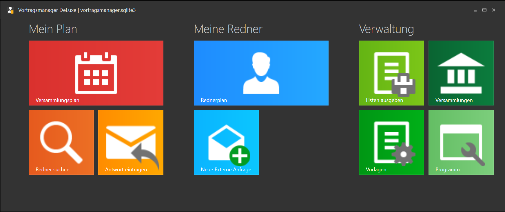

# Handbuch zum Vortragsmanager DeLuxe 1.0

Eine Kurzübersicht über das Programm findest du in der [Readme](./../README.md) im Hauptverzeichnis.

Dieses Handbuch geht detailierter auf die Installation, sowie auf die drei Hauptbereiche des Programm ein:
* Mein Plan -> Die Vortragsplanung deiner Versammlung
* Meine Redner -> Externe Einladungen deiner Redner
* Verwaltung -> Listen ausgeben, Programmeinstellungen und (Redner-)Daten pflegen

## [Installation](Installation.md) ##
Die Beschreibung der Installation und der ersten Schritte (Datenimport).

zur [Anleitung](Installation.md)

## Die Startseite ##

Der Vortragsmanager ist in 3 Bereiche aufgeteilt:

1. [Mein Plan](MeinPlan.md): Hier verwaltest du die Vorträge, die in deiner Versammlung gehalten werden.
    * [Redner suchen](MeinPlan.md#redner-suchen): passende Vorträge und Redner suchen und eine Mail an den Koordinator erzeugen.
    * [Antwort eintragen](MeinPlan#antwort-eintragen): Wenn der Koordinator sich dann meldet, kann seine Antwort hier eingetragen werden.

1. [Meine Redner](MeineRedner.md): Hier verwaltest du die Einladungen deiner Redner in anderen Versammlungen.
    * [Neue Externe Anfrage](MeineRedner.md#neue-externe-anfrage): Fragt ein Koordinator einen deiner Redner an, kannst du seine Verfügbarkeit hier prüfen und eine Antwort an den Koordinator generieren.

1. [Verwaltung](Verwaltung.md): Hier werden die Versammlungsdaten, Rednerdaten, Textvorlagen sowie Programmeinstellungen verwaltet. Außerdem können hier diverse Listen ausgegeben werden.
    * [Listen ausgeben](Verwaltung.md#listen-ausgeben)
    * [Versammlungen](Verwaltung.md#versammlungen): Versammlungs-, Koordinator- und Rednerdaten bearbeiten.
    * [Vorlagen](Verwaltung.md#vorlagen): Vorlagentexte für die Kommunikation mit anderen Verwalten.
    * [Programm](Verwaltung.md#programm): Programmeinstellungen vornehmen und Zusatzfunktionen aufrufen.
