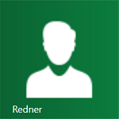
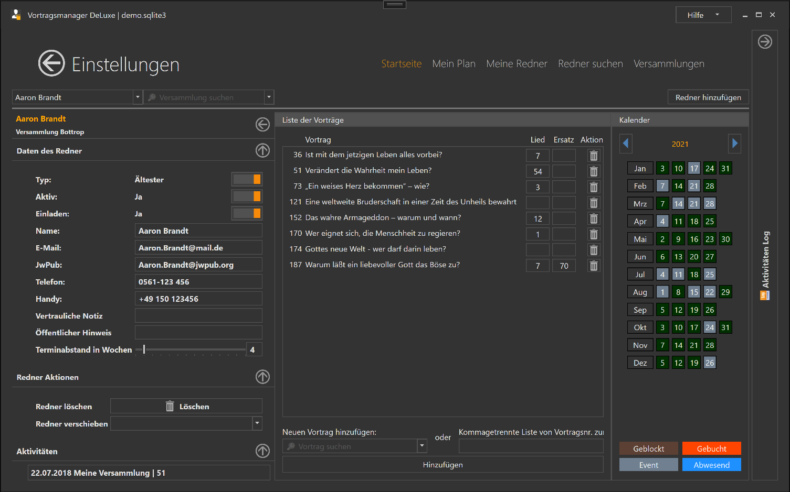

{: .align-right}

Im Bereich Redner werden alle Informationen zu den Rednern und ihren Vorträgen gepflegt. 
Alle Informationen können auch im Bereich Versammlungen angesehen und bearbeitet werden.

* [Daten des Redner](#daten)
* [Redner Aktionen](#aktionen)
* [Vorträge](#vorträge)

## Suche

Im Oberen Bereich des Fensters kann man nach beliebigen Rednern suchen. 
Rechts neben dem Eingabefeld befindet sich ein optionaler Filter, 
über den die Redner des linken Eingabefeldes auf eine einzelne Versammlung gefiltert werden können.
Außerdem hat man rechts die Möglichkeit einen neuen Redner für die im Versammlungsfilter eingestellte Versammlung anzulegen.

## Daten

* Typ: Dienstamtgehilfe (DAG) oder Ältester
* Aktiv: Der Redner hält in anderen Versammlungen Vorträge
* Einladen: Der Redner soll in der Rednersuche (nicht) erscheinen
* Diverse Kontaktdaten: Name, Mail JwPub, Telefon, Handy 
* Vertrauliche Notiz die innerhalb des Programm angezeigt werden (wird aktuell noch nicht weiter benutzt)
* Öffentliche Notiz die auf Plänen mit ausgedruckt werden (wird aktuell noch nicht weiter benutzt)

## Aktionen

* Redner löschen:
  Der Redner wird aus dem System gelöscht und sein Name mit "Unbekannt" ersetzt. Dies betrifft auch historische Vortragseinladungen

* Redner verschieben:  
  Hier kann ein Redner (z.B. nach Versammlungswechsel) einer anderen Versammlung zugeordnet werden.  
  Seine Vortragseinladungen (historische und zukünftige) bleiben dabei gespeichert.

## Aktivitäten

Eine Liste der letzten 10 Aktivitäten des Redners

* Vorträge die in meiner Versammlung gehalten wurden
* Vorträge meiner Redner

## Vorträge

Hier werden alle verfügbaren Vorträge des Redners angezeigt. Neben dem Vortrag kann auch das Lied sowie ein Ersatzlied gespeichert werden.
Der Vortrag kann über die Mülleimer-Aktion gelöscht werden.

Unterhalb der Vorträge kann man neue Vorträge zu dem aktuellen Redner inzugefügt werden. 
Dazu entweder links einen Vortrag aus der Liste auswählen,
oder rechts eine Kommagetrennte Liste von Vortragsnummern eingeben die dem Redner hinzugefügt werden sollen.
Beide möglichkeiten werden dann über den Button "Hinzufügen" gespeichert und direkt im oberen Bereich angezeigt.

[zurück](Versammlungen.md){: .btn .btn--inverse}  [weiter](ListenAusgeben.md){: .btn .btn--inverse}