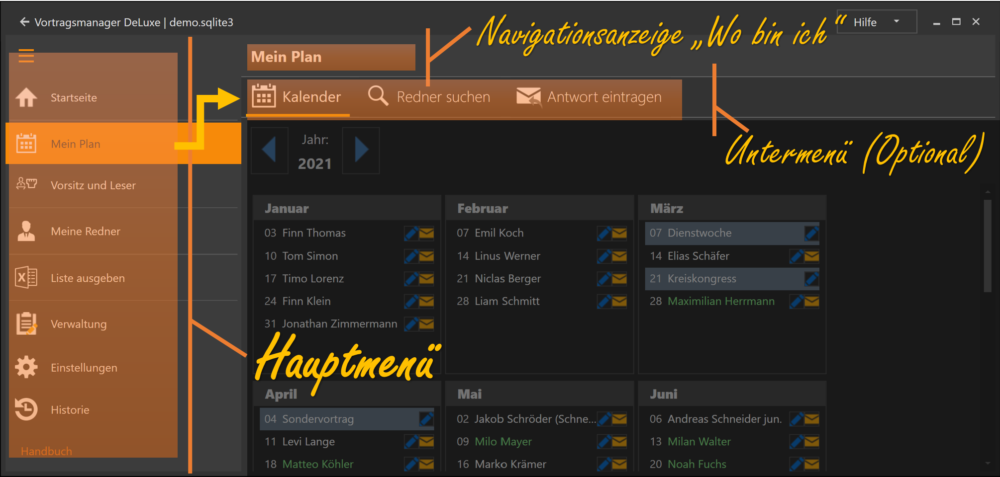
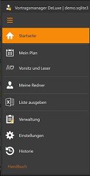

---
title: "Startseite"
---

Nach dem Programmstart siehst du deine Planung der nächsten 4 Wochen.
Links, die Programmplanung deiner eigenen Versammlung.
Rechts, deine Redner die in anderen Versammlungen eingeplant sind.

## Navigation ##

Das Programm ist in mehrere Hauptbereiche eingeteilt, die über das Linke Hauptmenü erreichbar sind.
Innerhalb der Hauptbereiche kann dann wiederum über das obere Navigationsmenü zu weiteren Unter-Bereichen navigiert werden.
Zur Orientierung wird oberhalb der Sub-Navigation angezeigt wo du dich im Programm gerade befindest.
Die Navigation orientiert sich an der Navigation der App "Jw Library", die Ebenfalls in Haupt- und Unterbereiche aufgeteilt ist.

### Die Hauptbereiche ###

Das Programm ist in folgende Hauptbereiche aufgeteilt:

* [Mein Plan](MeinPlan.md): Hier planst du deine eigenen Zusammenkünfte (Vortragsredner, Kongresse, besondere Ereignisse)
* [Vorsitz und Leser](WeiterePlannungen.md): Hier können der Vorsitzende und der Leser verwaltet und ihr Einsatz geplant werden.

* [Meine Redner](MeineRedner.md): Hier Verwaltest du die Einladungen deiner Redner in anderen Versammlungen

* [Listen ausgeben](ListenAusgeben.md): Diverse Listen, wie einen Aushang deiner Planung, Rednerlisten zum Austausch mit anderen Koordinatoren, etc.

* [Verwaltung](Verwaltung.md): Versammlungen, Redner, Vorträge und Vorlagen werden hier gepflegt.

* [Einstellungen](Einstellungen.md): Programmeinstellungen und andere Aktionen die keinem der obigen Bereiche zugeordnet sind.

* [Historie](Historie.md): Änderungen Rückgängig machen und vergangene Aktivitäten (wie z.B. Mailversand an andere) ansehen.

[zurück](Initialisierung.md){: .btn .btn--inverse}  [weiter](MeinPlan.md){: .btn .btn--inverse}
