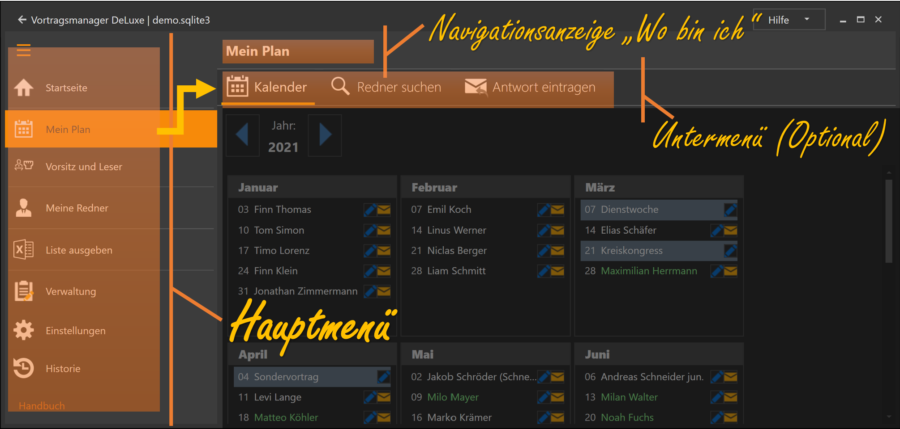

---
title: "Die Übersicht"
---

Startest du den Vortragsmanager wird dir die Zentrale Startseite des Programm angezeigt, von der du aus in alle Bereiche gehen kannst.
Du hast 4 verschiedene Möglichkeiten wie du starten kannst.

Jede Kachel führt zu einer Funktion im Programm. Die Kacheln sind in 3 Bereiche aufgeteilt:
Links dir Kacheln in den rötlichen Tönen haben alle mit der Planung für deine eigene Versammlung zu tun. Sie tragen die Überschrift "Mein Plan"
In der Mitte sind die Kacheln in den blautönen, für die Planung deiner Redner in anderen Versammlungen. Sie sind unter "Meine Redner" zusammengefasst.
Rechts sind die Kacheln der Kategorie "Verwaltung" in den grünen Kacheln mit allen anderen Themen.

## Mein Plan ##

* [Versammlungsplan](MeinPlan.md): Die Rote Kachel ist der Hauptbereich für deine Planung. Hier siehst du deine aktuelle Planung und kannst sie auch pflegen.
* [Redner suchen](MeinPlan.md#redner-suchen): Hier findest du die Vorträge und Redner die du schon länger nicht mehr gehört hast und kannst Einladungsmails generieren.
* [Antwort eintragen](MeinPlan.md#antwort-eintragen): Hat jemand auf deine Einladung geantwortet, trägst du hier die Antwort ein. Dein Versammlungsplan wird dann aktualisiert.
* [Vorsitz & Leser](WeiterePlannungen.md): Da die Planung von Vorsitz & Leser meistens auch dem Vortragskoordinator zufällt, kannst hier diese Planung vornehmen.
 
## Meine Redner ##

* [Rednerplan](MeineRedner.md): Hier siehst du die Vortragstermine aller deiner Redner
* [Neue Externe Anfrage](ExterneAnfrage.md): Fragt eine andere Versammlung einen Redner an, kannst du hier prüfen ob er zur Verfügung steht und in deine Planung eintragen.

## Verwaltung ##

* [Versammlungen](Versammlungen.md): Verwaltung aller Versammlungen und Kontaktdaten der Koordinatoren mit denen du Redner austauschen willst.
* [Redner](Redner.md): Verwaltung der Redner in den Versammlungen mit den Vorträgen die sie halten.
* [Listen ausgeben](ListenAusgeben.md): Diverse Listen, wie einen Aushang deiner Planung, Rednerlisten zum austausch mit anderen Koordinatoren, etc.
* [Vorlagen](Vorlagen.md): Hier werden die Mailvorlagen angepasst, z.B. deine Signatur
* [Programm](ProgrammEinstellungen.md): Allgemeine Programmeinstellungen
* [Vorträge](Vortragsthemen.md): Liste aller Vorträge, die Themen können hier angepasst werden.

# Unterseiten #

Mit einem Klick auf die Kachel kommst du in den Anzeige- oder Bearbeitungsmodus des jeweiligen Themas.
Die Unterseiten haben alle das gleiche Navigations-Menü im oberen Bereich

* Der Pfeil nach links bringt dich zurück zum letzten Bildschirm, meistens ist das die Startseite.
* Daneben steht der Name des aktuellen Fenster in dem du dich gerade befindest.
* im rechten Bereich hast du 5 Verknüpfungen auf Kacheln die du oft benötigst
** Startseite (orange) bringt dich immer zurück zur Startansicht
** "Mein Plan", "Meine Redner", "Redner suchen", "Versammlungen" bringt dich zur jeweiligen Kachel

[zurück](Initialisierung.md){: .btn .btn--inverse}  [weiter](MeinPlan.md){: .btn .btn--inverse}