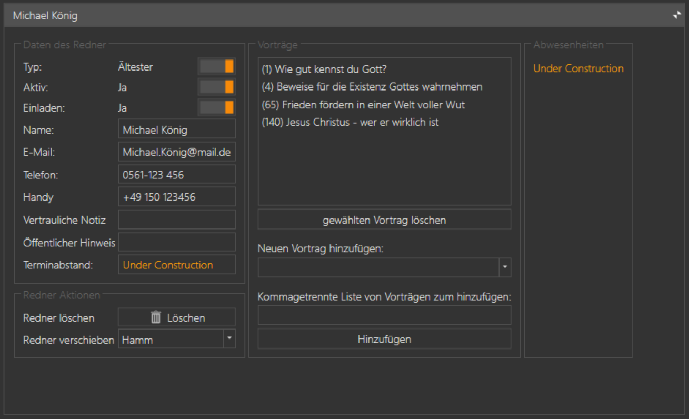

{: .align-right}

Im Bereich Versammlungen werden diverse Informationen gepflegt:

* [Versammlungen](#versammlung)
* [Koordinatoren](#koordinator)
* [Redner](#redner)

Öffnest du diesen Bereich werden dir alle angelegten Versammlungen mit dem Namen des Koordinator angezeigt.

Oben Rechts hast du die Möglichkeit die Liste der Versammlungen zu filtern. Du kannst entweder den Namen der Versammlung, des Koordinators oder die Kreisnummer eingeben. Die Versammlungen werden direkt während der Eingabe gefiltert.

Unten Rechts hast du über das gründe + -Zeichen die Möglichkeit eine neue Versammlung anzulegen.

Klickst du auf das grüne + -Zeichen, oder auf eine Versammlung, wird diese Versammlung vergrößert und dir werden Details zu der Versammlung angezeigt, die du hier auch direkt bearbeiten kannst.

## Versammlung

Im linken Bereich werden allgemeine Versammlungsdaten angezeigt, 
im Rechten Bereich die Redner die zu der Versammlung angelegt wurden.

### Daten der Versammlung

Die Oberste Funktion "Eigene Versammlung" Ja / Nein kann nur einmal auf Ja gesetzt werden. Du legst deine eigene Versammlung ganz normal wie jede andere Versammlung auch an, aktivierst aber diesen Schalter.

Die Entfernung (km) kannst du entweder selber eingeben, oder mit **Berechnen** durch Google berechnen lassen. Bei deiner eigenen Versammlung gibst du hier einfach eine 0 ein.
Lässt du das Feld leer, kannst du auch im Bereich [Programm](ProgrammEinstellungen.md) die Entfernung für alle Versammlungen mit einem Klick berechnen lassen.

### Koordinator

Die Kontaktdaten des Koordinator werden hier erfasst. JwPub steht für die Mailadresse von jw.org

### Zusammenkunftszeit

Hier wird der Tag und die Uhrzeit für die Zusammenkunft mit dem öffentlichen Vortrag eingegeben, z.B. "Sonntag 10:00 Uhr". Ändern sich die Zusammenkunftszeiten im jahres-Turnus, kannst du hier auch direkt die Zeiten für die nächsten Jahre eingeben.

### Sonstiges

Als letztes hast du hier noch die Option einen Neuen Redner anlegen.
Der Menüpunkt "Versammlung löschen" bietet dir die Möglichkeit entweder die Versammlung inkl. aller Redner zu löschen
oder die Versammlung mit einer anderen Versammlung zusammenzulegen. Adresse und weitere Informationen werden von der Zielversammlung übernommen,
bei den Kontaktdaten des Koordinator kann man wählen welcher der beiden Koordinatoren man in den Daten behalten möchte.

Zuteilungen der Vergangenheit werden dann abgeändert, der Vortrag bleibt weiterhin gespeichert, aber als Redner und Versammlung wird "unbekannt" eingetragen.

### Rednerliste

Die Redner können auch über das Hauptmenü [Redner](Redner.md) angezeigt und bearbeitet werden.

Im rechten Bereich werden die angelegten Redner angezeigt. Dargestellt werden folgende Informationen:

* Aktiv/Inaktiv (grün/rot) zeigt an ob der Redner weiterhin Vorträge in anderen Versammlungen hält.
* Ältester / DAG (blau/rot) zeigt an ob er Ältester oder Dienstamtgehilfe ist
* Darunter werden seine ausgearbeiteten Vortragsnummern angezeigt.

Klickt man auf einen Redner, oder klickt auf die Schaltfläche "Neuen Redner anlegen" wechselt das Programm in die Detailansicht eines Redners, in der die Informationen zum Redner auch direkt bearbeitet werden können.

## Redner

In der Titelleiste wird der Name des Redners hervorgehoben, Mit einem Klick auf die Titelleiste wird zwischen der Übersicht- und der Detailansicht gewechselt.

### Daten des Redner

Zuerst können drei Informationen eingestellt werden:

* Typ (Ältester oder Dienstamtgehilfe)
* Aktiv (kann eingeladen werden oder nicht)
* Einladen (Ja / Nein)

    Möchte ich einen Vortragsredner zukünftig nicht mehr einladen, könnte ich natürlich auch den Status von Aktiv auf Inaktiv ändern. Für die Programmverwaltung hätte das den gleichen effekt. Bekomme ich aber später eine aktualisierte Rednerliste, ist es für mich evtl. nicht mehr so einfach nachvollziehbar ob der Redner der Liste der bei mir auf Inaktiv steht von seiner Seite aus Inaktiv war und jetzt wieder Vorträge halten kann, oder ob ich ihn damals auf "Inaktiv" gesetzt hatte. 
    Über den Status Einladen Ja/Nein ist diese Information nachhaltiger erfasst.

Danach werden die Kontaktinformationen des Redners erfasst. Der öffentliche Hinweis wird aktuell nicht genutzt, es ist aber gedacht ihn in Aushängen oder in Mailtexten mit ausgeben zu lassen.

Die vertrauliche Notiz wird nur im Vortragsmanager selber angezeigt, aber in keinen Listen mit ausgegeben werden.

### Redner Aktionen

* Redner löschen

* Redner verschieben

    Hier kann ein Redner (z.B. nach Versammlungswechsel) einer anderen Versammlung zugeordnet werden. Seine Vortragseinladungen (historische und zukünftige) bleiben dabei gespeichert.

### Vorträge

Die Liste der Vorträge die ein Diener ausgearbeitet hat.

* gewählten Vortrag löschen - Löscht den gewählten Vortrag aus der Liste

* Neuen Vortrag hinzufügen - wähle einen Vortrag aus der Liste aus und füge ihn der Liste hinzu. Im Menü werden dir Vortragsnummer und Thema angezeigt.

* Kommagetrennte Liste von Vorträgen - trage hier Komma-, Semikolon- oder mit Leerzeichen getrennt die Vortragsnummern ein die ein Redner hat und füge sie mit einem Klick alle gleichzeitig zu der Liste seiner ausgearbeiteten Vorträge hinzu.

### Abwesenheiten

UNDER CONSTRUCTION

[zurück](ListenAusgeben.md){: .btn .btn--inverse}  [weiter](Redner.md){: .btn .btn--inverse}