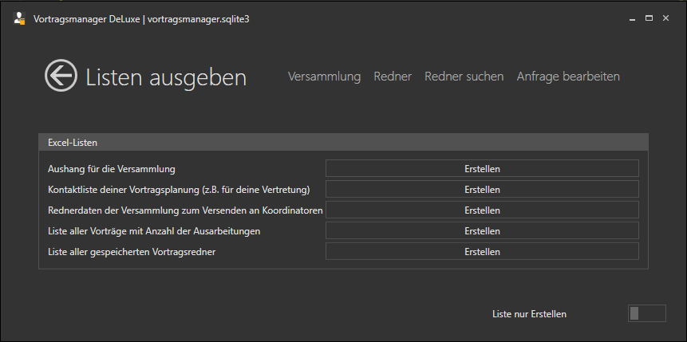
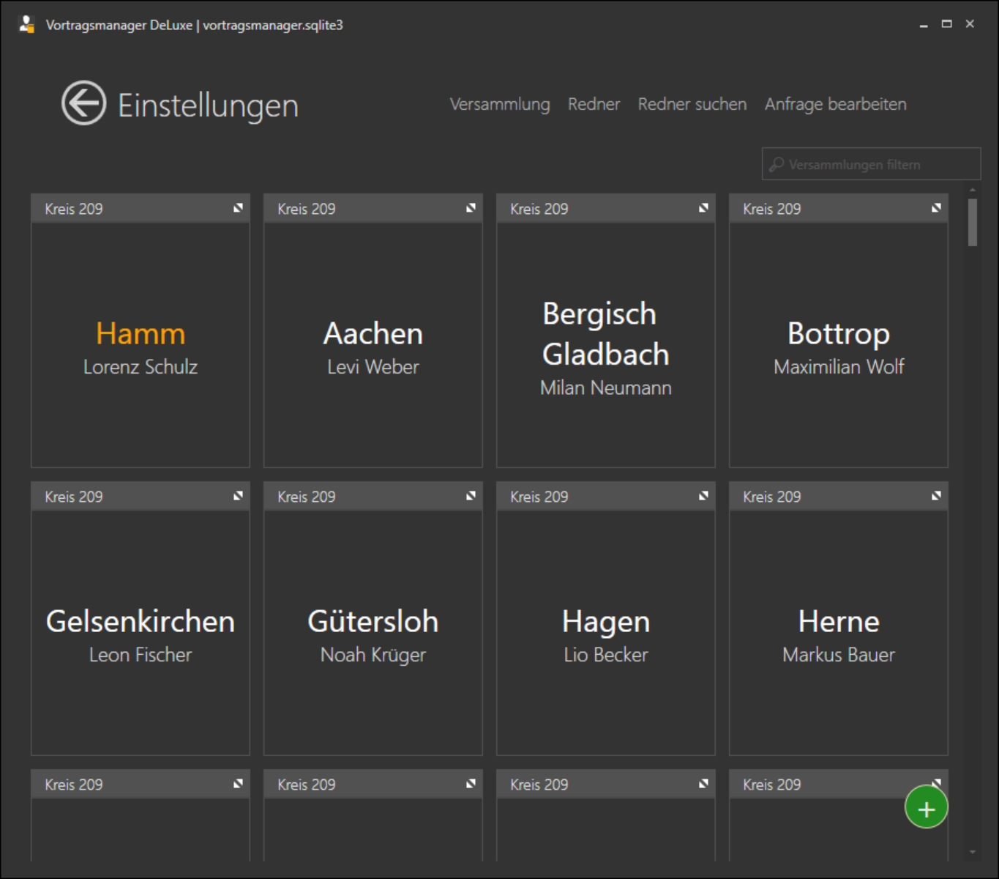
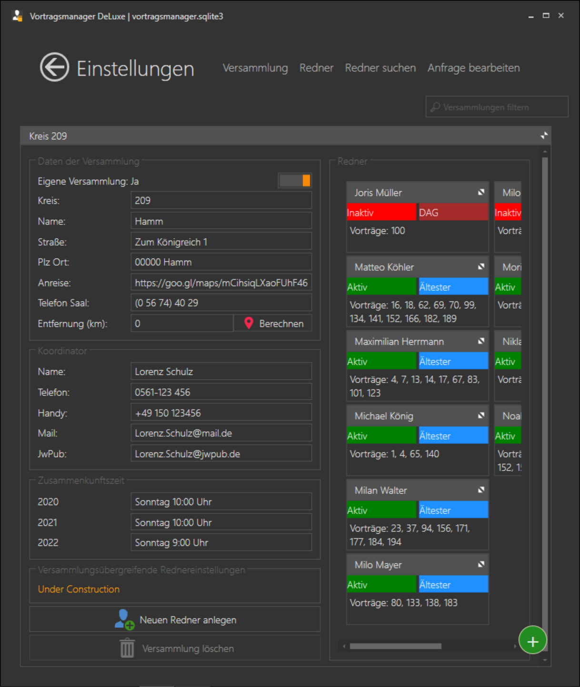
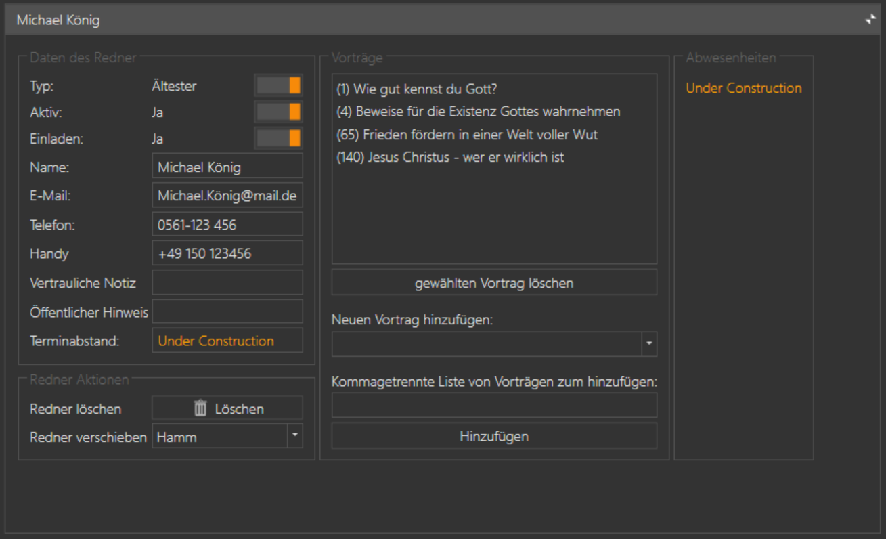
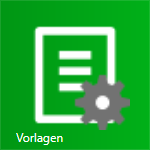
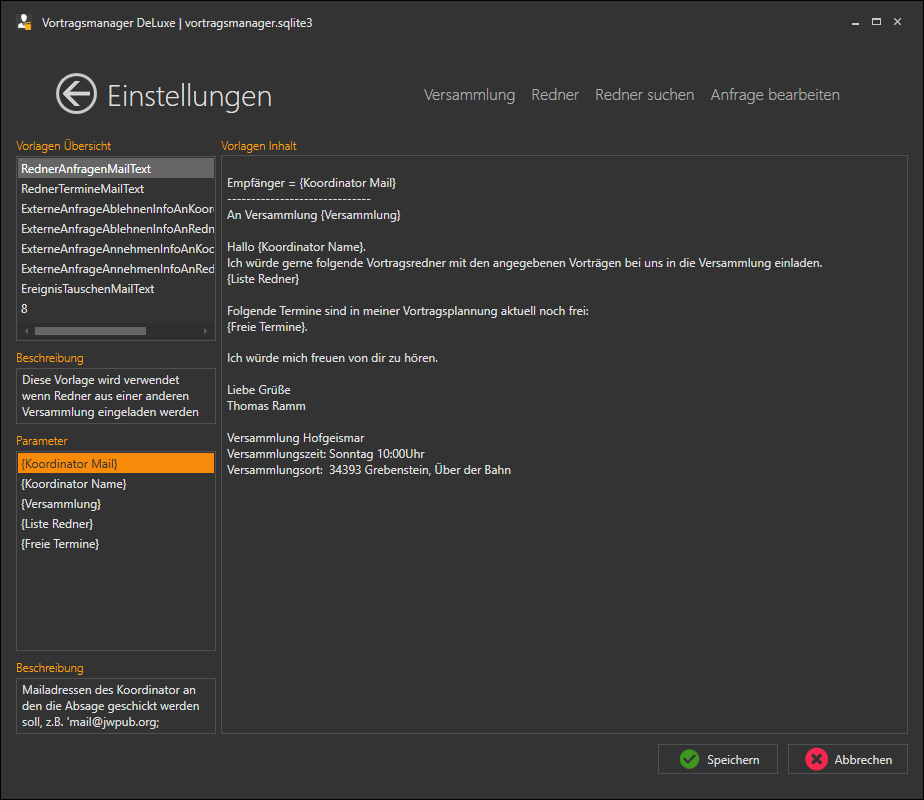
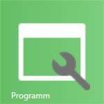
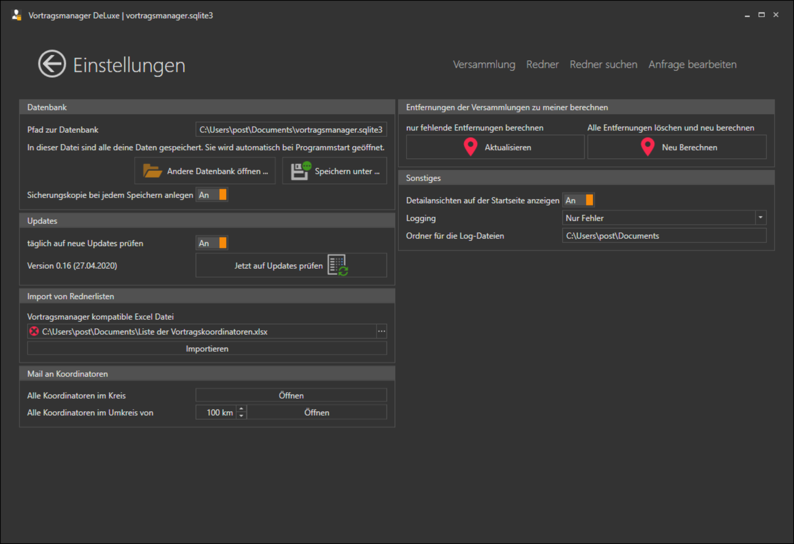

⇦ zurück zum [Inhaltsverzeichnis](README.md)

## Inhaltsverzeichnis
1. [Listen ausgeben](#listen-ausgeben)
1. [Versammlungen](#versammlungen)
1. 1. [Versammlungen](#versammlung)
1. 1. [Koordinatoren](#koordinator)
1. 1. [Redner](#redner)
1. [Vorlagen](#vorlagen)
1. [Programm](#programm)

# Listen ausgeben #

In diesem Bereich können diverse Listen und Aushänge erzeugt werden. Das Ausgabeformat ist für alle Listen Excel (*.xlsx)

im Bereich unten Rechts kann eingestellt werden ob die **Listen nur erstellt** - oder die **Liste nach dem erstellen öffnen** direkt im Verknüpften Programm geöffnet werden soll.

Folgende Listen können ausgegeben werden:

## Aushang für die Versammlung

Vorträge mit Redner, Auswärtige Einladungen sowie angabe des Vorsitzes und Lesers. Diese beiden Felder werden jedoch leer mit Ausgegeben und manuell gefüllt werden, eine Planung im Vortragsmanager ist noch nicht möglich (kommt aber noch).

## Kontaktliste deiner Vortragsplanung

Liste deiner geplanten Vorträge inkl. der Kontaktdaten der Koordinatoren und Redner (sofern gespeichert).

## Rednerdaten der Versammlung zum Versenden an Koordinatoren

Diese Liste kann an andere Koordinatoren versendet werden (Ich selber öffne sie in Excel und speichere sie dort als PDF ab, die ich dann versende). Sie enthält deine Kontaktdaten sowie die der Versammlung und eine Liste aller deiner Redner mit ihren Vorträgen.

## Liste aller Vorträge mit Anzahl der Ausarbeitungen

Eine Liste aller Vorträge mit der Information:
* Von wie vielen Rednern deiner Versammlung wurde der Vortrag ausgearbeitet
* Von wie vielen Rednern in deinem Kreis wurde der Vortrag ausgearbeitet
* Das Datum wann der Vortrag in deiner Versammlung das letzte mal gehalten wurde

## Liste aller gespeicherten Vortragsredner

Eine Liste aller Vortragsredner die im Programm eingegeben worden sind mit den hinterlegten Informationen, sowie dem Datum wann sie das letzte mal in deiner Versammlung einen Vortrag gehalten haben.

# Versammlungen #

Im Bereich Versammlungen werden diverse Informationen gepflegt:

* [Versammlungen](#versammlung)
* [Koordinatoren](#koordinator)
* [Redner](#redner)

Öffnest du diesen Bereich werden dir alle angelegten Versammlungen mit dem Namen des Koordinator angezeigt.

Oben Rechts hast du die Möglichkeit die Liste der Versammlungen zu filtern. Du kannst entweder den Namen der Versammlung, des Koordinators oder die Kreisnummer eingeben. Die Versammlungen werden direkt während der Eingabe gefiltert.

Unten Rechts hast du über das gründe + -Zeichen die Möglichkeit eine neue Versammlung anzulegen.

Klickst du auf das grüne + -Zeichen, oder auf eine Versammlung, wird diese Versammlung vergrößert und dir werden Details zu der Versammlung angezeigt, die du hier auch direkt bearbeiten kannst.

## Versammlung

Im linken Bereich werden allgemeine Versammlungsdaten angezeigt, 
im Rechten Bereich die Redner die zu der Versammlung angelegt wurden.

### Daten der Versammlung

Die Oberste Funktion "Eigene Versammlung" Ja / Nein kann nur einmal auf Ja gesetzt werden. Du legst deine eigene Versammlung ganz normal wie jede andere Versammlung auch an, aktivierst aber diesen Schalter.

Die Entfernung (km) kannst du entweder selber eingeben, oder mit **Berechnen** durch Google berechnen lassen. Bei deiner eigenen Versammlung gibst du hier einfach eine 0 ein.
Lässt du das Feld leer, kannst du auch im Bereich [Programm](+programm) die Entfernung für alle Versammlungen mit einem Klick berechnen lassen.

### Koordinator

Die Kontaktdaten des Koordinator werden hier erfasst. JwPub steht für die Mailadresse von jw.org

### Zusammenkunftszeit

Hier wird der Tag und die Uhrzeit für die Zusammenkunft mit dem öffentlichen Vortrag eingegeben, z.B. "Sonntag 10:00 Uhr". Ändern sich die Zusammenkunftszeiten im jahres-Turnus, kannst du hier auch direkt die Zeiten für die nächsten Jahre eingeben.

### Sonstiges

Als letztes hast du hier noch die Option einen Neuen Redner anlegen und die komplette Versammlung inkl. aller angelegten Redner zu löschen.

Zuteilungen der Vergangenheit werden dann abgeändert, der Vortrag bleibt weiterhin gespeichert, aber als Redner und Versammlung wird "unbekannt" eingetragen.

### Rednerliste

Im rechten Bereich werden die angelegten Redner angezeigt. Dargestellt werden folgende Informationen:

* Aktiv/Inaktiv (grün/rot) zeigt an ob der Redner weiterhin Vorträge in anderen Versammlungen hält.
* Ältester / DAG (blau/rot) zeigt an ob er Ältester oder Dienstamtgehilfe ist
* Darunter werden seine ausgearbeiteten Vortragsnummern angezeigt.

Klickt man auf einen Redner, oder klickt auf die Schaltfläche "Neuen Redner anlegen" wechselt das Programm in die Detailansicht eines Redners, in der die Informationen zum Redner auch direkt bearbeitet werden können.

## Redner

In der Titelleiste wird der Name des Redners hervorgehoben, Mit einem Klick auf die Titelleiste wird zwischen der Übersicht- und der Detailansicht gewechselt.

### Daten des Redner

Zuerst können drei Informationen eingestellt werden:

* Typ (Ältester oder Dienstamtgehilfe)
* Aktiv (kann eingeladen werden oder nicht)
* Einladen (Ja / Nein)

    Möchte ich einen Vortragsredner zukünftig nicht mehr einladen, könnte ich natürlich auch den Status von Aktiv auf Inaktiv ändern. Für die Programmverwaltung hätte das den gleichen effekt. Bekomme ich aber später eine aktualisierte Rednerliste, ist es für mich evtl. nicht mehr so einfach nachvollziehbar ob der Redner der Liste der bei mir auf Inaktiv steht von seiner Seite aus Inaktiv war und jetzt wieder Vorträge halten kann, oder ob ich ihn damals auf "Inaktiv" gesetzt hatte. 
    Über den Status Einladen Ja/Nein ist diese Information nachhaltiger erfasst.

Danach werden die Kontaktinformationen des Redners erfasst. Der öffentliche Hinweis wird aktuell nicht genutzt, es ist aber gedacht ihn in Aushängen oder in Mailtexten mit ausgeben zu lassen.

Die vertrauliche Notiz wird nur im Vortragsmanager selber angezeigt, aber in keinen Listen mit ausgegeben werden.

### Redner Aktionen

* Redner löschen

* Redner verschieben

    Hier kann ein Redner (z.B. nach Versammlungswechsel) einer anderen Versammlung zugeordnet werden. Seine Vortragseinladungen (historische und zukünftige) bleiben dabei gespeichert.

### Vorträge

Die Liste der Vorträge die ein Diener ausgearbeitet hat.

* gewählten Vortrag löschen - Löscht den gewählten Vortrag aus der Liste

* Neuen Vortrag hinzufügen - wähle einen Vortrag aus der Liste aus und füge ihn der Liste hinzu. Im Menü werden dir Vortragsnummer und Thema angezeigt.

* Kommagetrennte Liste von Vorträgen - trage hier Komma-, Semikolon- oder mit Leerzeichen getrennt die Vortragsnummern ein die ein Redner hat und füge sie mit einem Klick alle gleichzeitig zu der Liste seiner ausgearbeiteten Vorträge hinzu.

### Abwesenheiten

UNDER CONSTRUCTION

# Vorlagen #

Hier werden die Inhalte verwaltet die durch das Programm zum generieren der individuellen Mails benutzt werden. Jede Mailvorlage besteht aus zwei Bereichen:
* Dem Mailtext
* Den Platzhaltern die im Mailtext eingefügt werden.
Platzhalter werden im Mailtext durch {} -Klammern gekennzeichnet.

## Vorlagen Übersicht
Hier kannst du alle Verfügbaren vorlagen sehen und auswählen. Die Namen sind hoffentlich selbsterklärend.

## Beschreibung (Vorlage)
Eine kurze Beschreibung zu der ausgewählten Vorlage (wann wird sie benutzt).

## Parameter
Hier werden alle Parameter (Platzhalter) der gewählten Vorlage angezeigt

## Beschreibung (Parameter)
Eine kurze Beschreibung des gewählten Parameter (mit welchem Inhalt wird er ersetzt)

## Vorlagen Inhalt
Hier steht der Haupttext der Mailvorlage. Die Platzhalter müssen durch {}-Klammern gekennzeichnet sein. Insbesondere die Signatur (deine Kontaktdaten) sowie die Versammlungsdaten sollten hier einmalig eingesetzt und gespeichert werden.

# Programm #

Im Bereich Programm werden einige Programmweite Einstellungen vorgenommen, als auch Aktionen durchgeführt die sehr selten benötigt werden.

## Datenbank

Hier kann der Pfad zur Programmmanager-Datei geändert oder auch eine vorher gesicherte Datei geöffnet werden.

Ist die Option "Sicherungskopie bei jedem Speichern anlegen" aktiviert, werden während des arbeiten mit dem Vortragsmanager regelmäßig kopien der Datendatei angelegt, so dass man bei einem Fehler einfach eine ältere Version der Datei geöffnet werden kann. Im Dateisystem wird an den Dateinamen noch das Datum und die Uhrzeit angehangen.

z.B. die Datei vortragsmanager_2020-04-27-16-20.sqlite3 ist eine Kopie vom 27.04.2020 um 16:20 Uhr (der Standardname der Datei, wenn er nicht geändert wird, ist vortragsmanager.sqlite3 im Ordner Dokumente).

## Updates

Einmal am Tag prüft der Vortragsmanager im Internet ob eine neue Version des Programm verfügbar ist (sofern der Vortragsmanager an dem Tag gestartet wird). Das prüfen auf Updates kann hier deaktiviert werden, oder man kann die prüfung auf eine neue Version hier manuell starten (egal ob die tägliche Prüfung aktiviert oder deaktiviert ist).

## Import von Rednerlisten

Als ersten Test zum vereinfachten Datenaustausch ist hier die Möglichkeit eingebaut, Rednerlisten im Excelformat zu importieren.

UNDER CONSTRUCTION

## Mail an Koordinatoren

Musst du mal eine Rundmail an mehrere Koordinatoren schreiben, kannst du die Liste aller Mail-Adressen hier abrufen. 
Du kannst entweder alle Koordinatoren deines Kreises, oder alle Koordinatoren im Umkreis von XX km anschreiben.

## Entfernungen der Versammlungen zu meiner berechnen

Vortragsmanager kann für den Entfernungsfilter die Strecke von deinem Saal zu den anderen Sälen berechnen. Die Berechnung geschieht mit der Google Drive API. Als Start/Zieladresse wird die für die Versammlung hinterlegte Saaladresse genommen. Ist keine hinterlegt, wird der Mittelpunkt der Stadt als Routingpoint genommen.

Du kannst hier entweder alle Berechnungen neu vornehmen lassen, oder nur die fehlenden (z.B. neu angelegte Versammlungen) berechnen lassen.

Da ich kein Unbegrenztes Limit an Berechnungen bei Google habe, bitte ich diese Funktion nicht unnötig zu benutzen und nach Möglichkeit keine bereits gerechneten Entfernungen nochmals zu berechnen.

## Sonstiges

### Detailansichten auf der Startseite anzeigen

Durch diese Funktion wird auf der Startseite die nächste Vortragseinladung in deiner Versammlung, sowie der nächste externe Vortrag deiner Redner angezeigt. 

### Logging

Hier kann angegeben werden wie detailiert das Aufrufen von Funktionen im Vortragsmanager protokolliert werden soll.

Der Standard ist auf "Fehler" gesetzt. Das sollte bei den meisten Problemen helfen diese zu finden und zu beheben. Sollte man hier nicht weiter kommen, kann das Log noch auf **Alles Logen** umgestellt werden. Dies wird aber nur in seltenen Fällen bei Anfrage durch mich benötigt.

Im Ordner wird noch angegeben in welchem Ordner die Dateien abgelegt werden sollen. Der Dateiname ist immer vortragsmanager_DATUM.log und wird jeden Tag geändert.

⇦ zurück zum [Inhaltsverzeichnis](README.md)