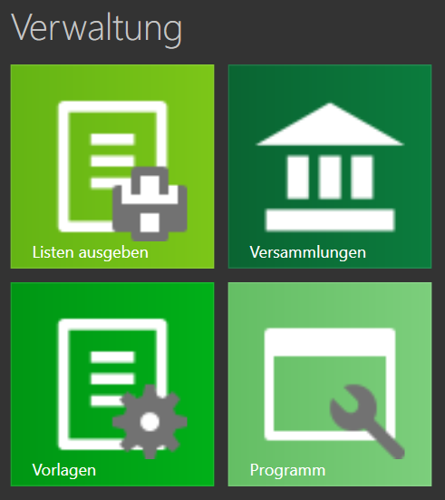

Der Bereich Verwaltung besteht aus 4 unterschiedlichen Teilen:

1. [Listen ausgeben](ListenAusgeben.md)
1. [Versammlungen](Versammlungen.md)
1. [Vorlagen](Vorlagen.md)
1. [Programm](ProgrammEinstellungen.md)





(Verwaltung.md){: .align-left}
(/Verwaltung/){: .align-right}
{: .align-left}
{: .align-right}

## test 1
{: .align-left}
{: .align-right}
{: .align-left}
{: .align-right}
## test 2
{: .align-left}
{: .align-left}
{: .align-left}
{: .align-left}
## test 3
{: .align-left}
{: .align-center}
{: .align-left}
{: .align-center}
## test 4
{: .align-left}
{: .align-right}

{: .align-left}
{: .align-right}
## test 5
{: .align-left}
{: .align-left}

{: .align-left}
{: .align-left}
## test 6
{: .align-left}
{: .align-center}

{: .align-left}
{: .align-center}

[zurück](MeineRedner.md){: .btn .btn--inverse}  [weiter](ListenAusgeben.md){: .btn .btn--inverse}