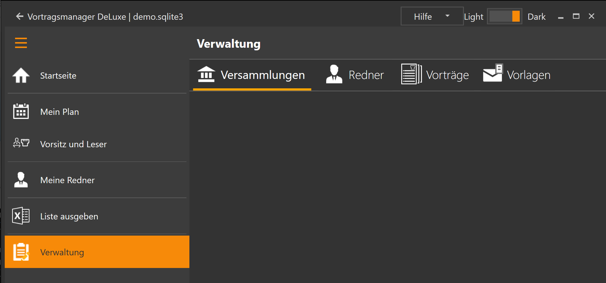

Dieser Programmbereich besteht aus vier Unterbereichen:

* [Versammlungen](VerwaltungVersammlungen.md): Verwaltung aller Versammlungen und Kontaktdaten der Koordinatoren mit denen du Redner austauschen willst.
* [Redner](VerwaltungRedner.md): Verwaltung der Redner in den Versammlungen mit den Vorträgen die sie halten.
* [Vorträge](VerwaltungVortragsthemen.md): Liste aller Vorträge, die Themen können hier angepasst werden.
* [Vorlagen](VerwaltungVorlagen.md): Hier werden die Mailvorlagen angepasst, z.B. deine Signatur

[zurück](ListeAusgeben.md){: .btn .btn--inverse}  [weiter](VerwaltungVersammlungen.md){: .btn .btn--inverse}