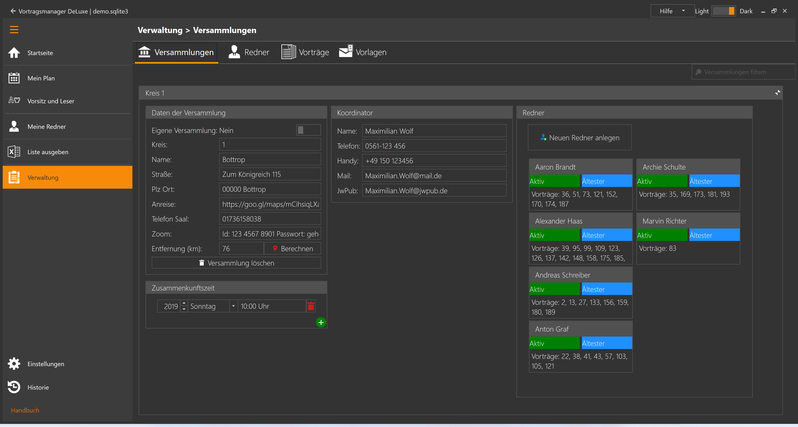

Im Bereich Versammlungen werden Informationen zu den Versammlungen gepflegt, aus denen du Redner einladen möchtest:

* [Versammlungen](#versammlung)
* [Koordinatoren](#koordinator)

Öffnest du diesen Bereich werden dir alle angelegten Versammlungen mit dem Namen des Koordinator angezeigt.

Oben Rechts hast du die Möglichkeit die Liste der Versammlungen zu filtern. Du kannst entweder den Namen der Versammlung, des Koordinators oder die Kreisnummer eingeben. Die Versammlungen werden direkt während der Eingabe gefiltert.

Unten Rechts hast du über das grüne + -Zeichen die Möglichkeit eine neue Versammlung anzulegen.

Klickst du auf das grüne + -Zeichen, oder auf eine Versammlung, wird diese Versammlung vergrößert und dir werden Details zu der Versammlung angezeigt, die du hier auch direkt bearbeiten kannst.

## Versammlung

Im linken Bereich werden allgemeine Versammlungsdaten angezeigt, 
im Rechten Bereich die Redner die zu der Versammlung angelegt wurden.

### Daten der Versammlung

Die Oberste Funktion "Eigene Versammlung" Ja / Nein kann nur einmal auf Ja gesetzt werden. Du legst deine eigene Versammlung ganz normal wie jede andere Versammlung auch an, aktivierst aber diesen Schalter.

Die Entfernung (km) kannst du entweder selber eingeben, oder mit **Berechnen** durch Google berechnen lassen. Bei deiner eigenen Versammlung gibst du hier einfach eine 0 ein.
Lässt du das Feld leer, kannst du auch im Bereich [Programm](Einstellungen.md) die Entfernung für alle Versammlungen mit einem Klick berechnen lassen.

### Koordinator

Die Kontaktdaten des Koordinator werden hier erfasst. JwPub steht für die Mailadresse von jw.org

### Zusammenkunftszeit

Hier wird der Tag und die Uhrzeit für die Zusammenkunft mit dem öffentlichen Vortrag eingegeben, z.B. "Sonntag" + "10:00 Uhr". Ändern sich die Zusammenkunftszeiten im Jahres-Turnus, kannst du hier auch direkt die Zeiten für die nächsten Jahre eingeben.

### Sonstiges

Als letztes hast du hier noch die Option einen Neuen Redner anlegen.
Der Menüpunkt "Versammlung löschen" bietet dir die Möglichkeit entweder die Versammlung inkl. aller Redner zu löschen
oder die Versammlung mit einer anderen Versammlung zusammenzulegen. Adresse und weitere Informationen werden von der Zielversammlung übernommen,
bei den Kontaktdaten des Koordinator kann man wählen welcher der beiden Koordinatoren man in den Daten behalten möchte.

Zuteilungen der Vergangenheit werden dann abgeändert, der Vortrag bleibt weiterhin gespeichert, aber als Redner und Versammlung wird "unbekannt" eingetragen.

### Rednerliste

Die Redner können auch direkt über das Hauptmenü [Redner](VerwaltungRedner.md) angezeigt und aufgerufen werden.

Im rechten Bereich werden die angelegten Redner angezeigt. Dargestellt werden folgende Informationen:

* Aktiv/Inaktiv (grün/rot) zeigt an ob der Redner weiterhin Vorträge in anderen Versammlungen hält.
* Ältester / DAG (blau/rot) zeigt an ob er Ältester oder Dienstamtgehilfe ist
* Darunter werden seine ausgearbeiteten Vortragsnummern angezeigt.

Klickt man auf einen Redner, oder klickt auf die Schaltfläche "Neuen Redner anlegen" wechselt das Programm zu der Kachel "Redner" in der die Informationen zum Redner bearbeitet werden können.

[zurück](Verwaltung.md){: .btn .btn--inverse}  [weiter](VerwaltungRedner.md){: .btn .btn--inverse}